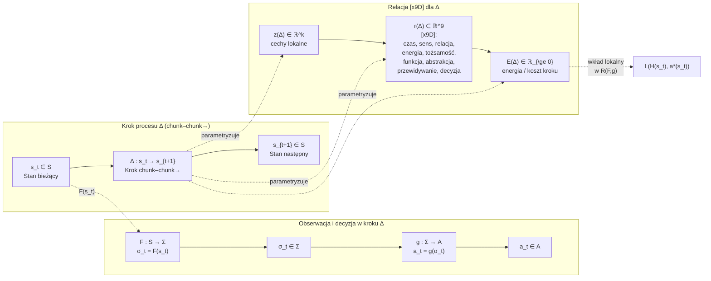

# Wprowadzenie – Protokół HoloMozaikowej Kompresji 9D (HMK-9D 4 GlitchLab)

  

Współczesne systemy Human–AI funkcjonują nie jako pojedyncze, statyczne automaty decyzyjne, lecz jako gęste, wielowarstwowe sieci procesów, w których kolejne decyzje nadpisują siebie wzajemnie w czasie. Klasyczny obraz opiera się na polityce

$$
\pi(a \mid s),
$$

w której stan $$s \in S$$ przechodzi w działanie $$a \in A$$ zgodnie z ustaloną regułą. Ten opis jest konieczny, ale niewystarczający: nie mówi nic o **geometrii protokołu**, czyli o tym, jak system:

* porcjuje strumień zdarzeń w kroki typu `chunk–chunk→`,
* układa te kroki w trajektorie,
* kształtuje relacje między krokami,
* rozkłada globalny błąd $$R(F,g)$$ względem dolnej granicy $$R^*(K)$$ na lokalne wkłady.

Protokół HoloMozaikowej Kompresji 9D (HMK-9D) dopełnia ten brak. Nie zastępuje kontraktu

$$ \big(S, \Sigma, A, F, g, H, a^*\big),$$

lecz wprowadza nad nim **warstwę organizującą**, w której proces jest widziany jako ciąg kroków $$\Delta$$ osadzonych w przestrzeni stanów, z jawnie modelowaną strukturą relacji między nimi.

Każdy krok

$$\Delta : s_t \to s_{t+1} $$

jest minimalnym przejściem typu `chunk–chunk→`: stan $$s_t$$ zostaje skompresowany przez $$F : S \to \Sigma$$, przetworzony przez politykę $$g : \Sigma \to A$$, a wynikowe działanie aktualizuje stan do $$s_{t+1}$$. Zamiast traktować ten krok jako czarną skrzynkę, HMK-9D rozkłada go na:

* wektor cech lokalnych
  $$z(\Delta) \in \mathbb{R}^k,$$
* wektor relacji (inwariant 9D)
  $$r(\Delta) \in \mathbb{R}^9,$$
* lokalną energię kroku
  $$E(\Delta) \in \mathbb{R}_{\ge 0}.$$

Wektor

$$r(\Delta) = [x9D]$$

opisuje rozkład obciążenia w dziewięciu wymiarach: czasu, sensu, relacji, energii poznawczej, tożsamości roli, funkcji (mandatu), poziomu abstrakcji, przewidywania oraz decyzji–tokenu. Znak $$[x9D]$$ jest **inwariantem kompresji**: minimalnym zestawem współrzędnych, które pozostają stabilne po przejściu przez $$F$$ i nadal pozwalają polityce $$g$$ wybrać działanie bliskie idealnemu $$a^*$$.

Lokalna energia kroku może być odczytywana jako przybliżenie lokalnej straty:

$$E(\Delta) ;\approx; L\big(H(s_t), a^*(s_t)\big),$$

a globalna energia mozaiki

$$E_{\text{total}} ;=; \sum_{\Delta} E(\Delta)$$

staje się mozaikową aproksymacją globalnego ryzyka $$R(F,g)$$ — ale już **z informacją o tym, gdzie** w trajektorii ten koszt powstaje.

Relacje między krokami są w HMK-9D obiektami pierwszej klasy. Trajektoria

$$s_0 \to s_1 \to s_2 \to \dots$$

jest widziana jako szereg kroków $$\Delta_0, \Delta_1, \dots$$, połączonych nie tylko strzałkami czasowymi, ale także:

* **stałymi mostami semantycznymi** oznaczanymi znakiem „–”, np.
  `Plan–Pauza`, `Rdzeń–Peryferia`, `Cisza–Wydech`, które definiują **osie kompresji** – stabilne pary biegunów, wzdłuż których porządkowane są wektory $$r(\Delta)$$,
* **progami przejścia** oznaczanymi znakiem „‡”, które wyznaczają miejsca zmiany reżimu: inny dopuszczalny błąd, inne ważenie wymiarów $$[x9D]$$, inną interpretację energii $$E(\Delta)$$ w bilansie globalnym.

Zbiór kroków z danego epizodu tworzy **mozaikowe pole sterowania**: do każdego indeksu $$i \in I$$ przypisujemy trójkę

$$\Phi(i) = \big(z_i, r_i, E_i\big),$$

co daje dyskretne pole

$$\Phi : I \to \mathbb{R}^k \times \mathbb{R}^9 \times \mathbb{R}_{\ge 0}.$$

Sterowanie systemem polega wtedy nie na pojedynczej globalnej komendzie, lecz na **przełączaniu i przegrupowywaniu kafelków mozaiki** tak, aby konfiguracja minimalizowała $$E_{\text{total}}$$ w granicach wyznaczonych przez $$R^*(K)$$. Intuicja jest bliska „mosaic warfare”: sterujesz strukturą kafelków, a nie tylko lokalnymi ruchami.

---

## Schemat działania protokołu HMK-9D

Ogólny schemat HMK-9D można zapisać jako warstwę nakładaną na klasyczny kontrakt decyzyjny:

1. **Poziom kontraktu (nagie S, Σ, A, F, g, H, a\*).**
   Ustalone są:

   * przestrzeń stanów $$S$$,
   * alfabet obserwacji $$\Sigma$$,
   * przestrzeń działań $$A$$,
   * funkcja kompresji
     $$F : S \to \Sigma,$$
   * polityka decyzyjna
     $$g : \Sigma \to A,$$
   * zachowanie
     $$H = g \circ F,$$
   * idealna polityka
     $$a^*$$
     i ryzyko
     $$R(F,g)$$
     z dolną granicą
     $$R^*(K).$$

2. **Poziom kroków Δ (chunk–chunk→).**
   Strumień stanów jest porcjowany na minimalne przejścia

   $$\Delta_i : s_i \to s_{i+1},$$

   tak aby każdy krok odpowiadał pojedynczemu zdarzeniu w sensie protokołu `chunk–chunk→`.

3. **Poziom inwariantu 9D.**
   Dla każdego kroku wyznaczane są:

   * cechy lokalne $$z(\Delta_i) \in \mathbb{R}^k,$$
   * wektor relacji $$r(\Delta_i) \in \mathbb{R}^9 = [x9D],$$
   * lokalna energia $$E(\Delta_i) \in \mathbb{R}_{\ge 0}.$$

   Wektory $$r(\Delta_i)$$ są interpretowane przez stały słownik osi 9D (czas, sens, relacja, energia, tożsamość, funkcja, abstrakcja, przewidywanie, decyzja–token).

4. **Poziom mozaiki Φ.**
   Rodzina kroków tworzy pole

   $$
   \Phi(i) = \big(z_i, r_i, E_i\big),
   \qquad i \in I,
   $$

   a globalna energia

   $$
   E_{\text{total}} = \sum_{i \in I} E_i
   $$

   stanowi mozaikową reprezentację ryzyka $$R(F,g)$$.

5. **Poziom mostów i progów.**
   Na mozaikę nakładany jest stały zestaw mostów semantycznych (np. `Plan–Pauza`, `Rdzeń–Peryferia`, `Wioska–Miasto`, `Human–AI`) i progów `‡`, które:

   * definiują preferowane kierunki zmian wektorów $$r(\Delta)$$,
   * sterują przejściami między reżimami (różne ważenie osi $$[x9D]$$, różne limity energii),
   * wprowadzają punkty bez powrotu (commit / zapis do historii systemu).

6. **Poziom microcode / HMK9D_VM.**
   Dla powtarzalnych procesów (np. run GlitchLab, analiza wątku, deploy) definiowane są programy microcode, które sekwencjonują:

   * operacje segmentacji (`CHUNK_SEG`),
   * zastosowanie mostów (`APPLY_BRIDGE`),
   * akumulację energii (`ACCUM_ENERGY`),
   * wejście w próg i commit (`ENTER_GATE`, `COMMIT_IF_OK`),
   * sprzężenie zwrotne (`FEEDBACK_UPDATE`, `EMIT_STEP_EVENT`).

   Maszyna HMK-9D aktualizuje rejestr stanu 9D, liczy $$E(\Delta)$$ oraz publikuje zdarzenia do warstwy danych (EGDB GlitchLab), gdzie mozaika Φ może być analizowana jak realne pole sterowania.

Ten schemat stanowi warstwę „0-ro”: pomost między czystą teorią kontraktu decyzyjnego a szczegółową definicją kroków, energii i mostów, która pojawi się w następnych częściach.

## 0. Dlaczego sam kontrakt $$\big(S, \Sigma, A, F, g, H, a^*\big)$$ nie wystarcza

W klasycznych ujęciach uczenia maszynowego i teorii decyzji system opisuje się jako maszynę decyzyjną operującą na przestrzeni stanów. Mamy więc:

* przestrzeń stanów $$S$$,
* alfabet obserwacji $$\Sigma$$,
* przestrzeń działań $$A$$,
* funkcję kompresji (obserwacji)
  $$F : S \to \Sigma,$$
* politykę decyzyjną
  $$g : \Sigma \to A.$$

Złożenie

$$
H ;=; g \circ F : S \to A
$$

opisuje rzeczywiste zachowanie systemu, a funkcja straty

$$
L : A \times A \to \mathbb{R}_{\ge 0}
$$

pozwala zdefiniować globalne ryzyko

$$
R(F,g) ;=; \mathbb{E}_{s \sim P}\Big[L\big(H(s), a^*(s)\big)\Big],
$$

gdzie idealna polityka

$$
a^* : S \to A
$$

pełni rolę niedostępnego punktu odniesienia.

To ujęcie jest matematycznie poprawne, ale **płaskie**. Nie mówi nic o tym, jak system:

1. **porcjuje proces w czasie** – czy decyzje powstają w małych krokach, czy w dużych blokach;
2. **układa trajektorię decyzji** – które kroki są techniczne, a które normatywne;
3. **przenosi błąd lokalny na poziom globalny** – gdzie w łańcuchu powstaje koszt, a gdzie tylko się propaguje;
4. **kontroluje energię poznawczą i inżynieryjną** – ile „wysiłku” wymaga podjęcie konkretnej decyzji.

Kontrakt
$$\big(S, \Sigma, A, F, g, H, a^*\big)$$
pozwala policzyć średnie ryzyko $$R(F,g)$$, ale:

* nie rozróżnia kroku typu „dopisz komentarz w kodzie” od kroku „zmień politykę bezpieczeństwa” – oba są tylko innymi wartościami w $$A$$,
* nie wskazuje, które fragmenty trajektorii są **krytyczne strukturalnie** (progi, commity, zmiana reżimu),
* nie ma pojęcia **geometrii procesu**: nie widzi mozaiki kroków, tylko punktowy mapping

$$
s \mapsto H(s).
$$

Protokół HoloMozaikowej Kompresji 9D (HMK-9D) jest nadbudową nad tym kontraktem. Zamiast zmieniać samą definicję ryzyka, HMK-9D:

* **jawnie wprowadza kroki procesu**
  $$\Delta : s_t \to s_{t+1},$$
  które odpowiadają minimalnym przejściom typu `chunk–chunk→` w kontekście Human–AI,

* do każdego kroku przypisuje:

  * wektor cech lokalnych
    $$z(\Delta) \in \mathbb{R}^k,$$
  * wektor relacji (inwariant 9D)
    $$r(\Delta) \in \mathbb{R}^9,$$
  * energię kroku
    $$E(\Delta) \in \mathbb{R}_{\ge 0},$$

* **układa kroki w mozaikę**
  $$\Phi : I \to \mathbb{R}^k \times \mathbb{R}^9 \times \mathbb{R}_{\ge 0},\qquad \Phi(i) = \big(z_i, r_i, E_i\big),$$
  gdzie $$I$$ jest zbiorem indeksów kroków w rozpatrywanym epizodzie.

Wtedy globalną energię mozaiki definiujemy jako

$$
E_{\text{total}} ;=; \sum_{i \in I} E_i,
$$

a HMK-9D traktuje

$$
E_{\text{total}} ;\approx; R(F,g)
$$

jako **mozaikową aproksymację** klasycznego ryzyka: nie tylko wiemy *ile* wynosi średni koszt, ale także *gdzie* w trajektorii on powstaje.

Intuicja jest następująca:

> klasyczny kontrakt decyzyjny mówi, *jakie* jest ryzyko średnie,
> HMK-9D mówi dodatkowo, *gdzie w procesie* powstaje koszt
> i *jak jest rozłożony* w mozaice kroków `chunk–chunk→`.

W GlitchLab taki opis nie jest metaforą, ale **narzędziem inżynierskim**. Pozwala:

* traktować wątki konwersacyjne, logi, commity jako trajektorie w $$S$$,
* mierzyć obciążenie **mostów semantycznych** (Plan–Pauza, Wioska–Miasto, Human–AI, …),
* projektować generatory i roje agentów tak, aby nie tylko minimalizowały błąd,
  ale utrzymywały proces w akceptowalnych reżimach energii i odpowiedzialności.

---

## 1. Rdzeń formalny: kontrakt decyzyjny w wersji „nagiej”

Zanim nałożymy na kontrakt geometrię HMK-9D, potrzebujemy czystej, minimalistycznej definicji, która nie odwołuje się do psychologii, metafor ani architektury systemowej. W tej sekcji pracujemy wyłącznie na poziomie zbiorów i funkcji.

### 1.1. Przestrzeń stanów $$S$$

Przez $$S$$ oznaczamy pełną przestrzeń stanów systemu Human–AI, który analizujemy. Pojedynczy stan

$$
s \in S
$$

może zawierać równocześnie:

* wewnętrzny stan modelu (ukryte wektory, cache, zegary, stany narzędzi),
* stan środowiska zewnętrznego (otwarte pliki, konfigurację sieci, zawartość repozytorium),
* historię dotychczasowych interakcji (logi rozmów, historię commitów, decyzje użytkownika).

W HMK-9D **nie rozbijamy** $$S$$ na podskładniki. Traktujemy je jako „pełny stan rzeczy”, który idealny obserwator mógłby zobaczyć **przed** kompresją.

### 1.2. Alfabet obserwacji $$\Sigma$$

Przez $$\Sigma$$ oznaczamy alfabet sygnałów, które mogą trafić do polityki decyzyjnej. Pojedynczy symbol

$$
\sigma \in \Sigma
$$

może reprezentować:

* token tekstowy (słowo, jego fragment),
* symbol sterujący (np. znacznik `[LINUX]` w HUD-zie),
* skrót techniczny (np. `"HMK-9D"`, znak progu `‡`, nazwa mostu `Plan–Pauza`),
* agregat kilku tokenów interpretowany jako jedna jednostka decyzyjna.

Kompresja stanu zachodzi właśnie do $$\Sigma$$ – wszystko, czego **nie da się odtworzyć** z $$\sigma$$, jest z punktu widzenia decyzji **utracone**.

Formalnie:

$$
F : S \to \Sigma,
\qquad
\sigma = F(s).
$$

### 1.3. Przestrzeń działań $$A$$

Przez $$A$$ oznaczamy zbiór wszystkich dopuszczalnych działań systemu. Element

$$
a \in A
$$

może być:

* wypowiedzią tekstową (odpowiedź LLM-a),
* akcją techniczną (zapis pliku, wywołanie skryptu, zapytanie SQL),
* sygnałem metakognitywnym („poproś o doprecyzowanie”, „wstrzymaj odpowiedź”),
* decyzją pasywną („brak odpowiedzi”).

Definicja $$A$$ jest niezależna od implementacji (LLM, system regułowy, hybryda). Interesuje nas tylko to, że **dla każdej** obserwacji $$\sigma$$ można wybrać jakieś działanie $$a$$.

### 1.4. Funkcja kompresji $$F : S \to \Sigma$$

Funkcja kompresji

$$
F : S \to \Sigma
$$

jest **jedynym dozwolonym oknem** na stan. Dla każdego

$$
s \in S
$$

obserwator widzi wyłącznie

$$
\sigma = F(s).
$$

W praktyce $$F$$ może obejmować:

* tokenizację i embedding,
* wybór fragmentów kontekstu (np. RAG, pamięć profilu, PCE),
* filtry bezpieczeństwa (usuwanie informacji niedozwolonych).

W HMK-9D będziemy dodatkowo interpretować $$F$$ jako mechanizm **porcjowania trajektorii** na kroki `chunk–chunk→`, ale na tym etapie pozostajemy przy czystym formalizmie: $$F$$ zachowuje tyle informacji, ile wystarcza polityce $$g$$ do działania.

### 1.5. Polityka działania $$g : \Sigma \to A$$

Polityka

$$
g : \Sigma \to A
$$

jest **jedynym dozwolonym mechanizmem decyzyjnym**. Dla każdej obserwacji $$\sigma$$ wyznacza działanie

$$
a = g(\sigma).
$$

Kluczowe ograniczenie:

* $$g$$ **nie widzi** pełnego stanu $$s$$,
* operuje wyłącznie na zredukowanej reprezentacji
  $$\sigma = F(s).$$

Każda utrata informacji na poziomie $$F$$ musi zostać:

* odpracowana konstrukcją $$g$$, albo
* zaakceptowana jako **nieusuwalny składnik błędu**.

### 1.6. Rzeczywiste zachowanie $$H = g \circ F$$ i nieusuwalne ryzyko

Złożenie

$$
H ;=; g \circ F : S \to A
$$

opisuje realne zachowanie systemu. Dla danego stanu $$s$$ mamy:

$$
H(s) = g\big(F(s)\big).
$$

To właśnie $$H$$ podlega ocenie w kategoriach ryzyka względem idealnej polityki $$a^* : S \to A$$.

Niech funkcja straty

$$
L : A \times A \to \mathbb{R}_{\ge 0}
$$

mierzy „odległość” pomiędzy działaniem rzeczywistym a idealnym. Przy rozkładzie stanów $$P$$ na $$S$$ globalne ryzyko definiujemy jako

$$
R(F,g) ;=; \mathbb{E}_{s \sim P}\Big[L\big(H(s), a^*(s)\big)\Big].
$$

Jeżeli dodatkowo rozważamy klasę dopuszczalnych par

$$
(F,g) \in K,
$$

to **optymalne ryzyko Bayesowskie** (dolną granicę błędu) określamy jako

$$
R^*(K) ;=; \inf_{(F,g) \in K} R(F,g).
$$

Dla każdej konkretnej pary $$(F,g)$$ zachodzi zatem

$$
R(F,g) ;\ge; R^*(K).
$$

### 1.7. Mozaikowe pole DARPA jako pole sterowania

Mając zdefiniowany kontrakt

$$
\big(S, \Sigma, A, F, g, H, a^*\big)
$$

oraz lokalne wielkości

$$
z(\Delta) \in \mathbb{R}^k, \qquad
r(\Delta) \in \mathbb{R}^9, \qquad
E(\Delta) \in \mathbb{R}_{\ge 0},
$$

możemy przejść od pojedynczych kroków $$\Delta$$ do poziomu **mozaiki epizodu**.

Niech $$I$$ będzie zbiorem indeksów kroków w pewnym skończonym epizodzie (np. jednej rozmowie, jednym przebiegu systemu, jednej sesji GlitchLab). Dla każdego

$$
i \in I
$$

mamy krok

$$
\Delta_i : s_t \to s_{t+1}
$$

oraz odpowiadające mu wielkości

$$
z_i ;=; z(\Delta_i), \qquad
r_i ;=; r(\Delta_i), \qquad
E_i ;=; E(\Delta_i).
$$

Definiujemy wtedy **mozaikowe pole sterowania** jako odwzorowanie

$$
\Phi : I \to \mathbb{R}^k \times \mathbb{R}^9 \times \mathbb{R}_{\ge 0},
\qquad
\Phi(i) ;=; \big(z_i, r_i, E_i\big).
$$

Każdy indeks $$i$$ odpowiada pojedynczemu „kafelkowi” mozaiki – lokalnej decyzji typu `chunk–chunk→`, osadzonej w przestrzeni stanów $$S$$ i opisanej przez:

* $$z_i$$ – **lokalną geometrię sygnału** (co się faktycznie dzieje w tym fragmencie trajektorii),
* $$r_i$$ – **konfigurację inwariantu 9D** $$[x9D]$$ (które wymiary są obciążone: czas, sens, relacja, energia, rola, mandat, abstrakcja, przewidywanie, decyzja–token),
* $$E_i$$ – **lokalny koszt** tego kroku (łączący błąd decyzyjny, energię poznawczą i koszt systemowy).

Globalną energię mozaiki w epizodzie definiujemy jako sumę lokalnych wkładów:

$$
E_{\text{total}} ;=; \sum_{i \in I} E_i.
$$

Jeżeli część decyzyjna energii $$E_i$$ jest dobrana tak, aby przybliżać lokalną stratę

$$
L\big(H(s_i), a^*(s_i)\big),
$$

to średnia energia na krok

$$
\widehat{R}*{\text{ep}}(F,g)
;;:=;;
\frac{1}{\lvert I \rvert}
\sum*{i \in I} E_i
$$

jest **empiryczną mozaikową aproksymacją** klasycznego ryzyka $$R(F,g)$$ w tym epizodzie:

$$
\widehat{R}_{\text{ep}}(F,g)
;;\approx;;
R(F,g),
$$

a suma

$$
E_{\text{total}}
;;=;;
\lvert I \rvert \cdot \widehat{R}_{\text{ep}}(F,g)
$$

może być odczytywana jako „ile kosztowała” dana trajektoria – w sensie błędu, energii poznawczej i zasobów technicznych.

W tym sensie zależność

$$
E_{\text{total}} ;\approx; R(F,g)
$$

nie oznacza równości analitycznej, lecz **związek między dwoma poziomami opisu**:

* $$R(F,g)$$ – poziom **statystyczny**, definiowany względem rozkładu $$P$$ na całej przestrzeni stanów $$S$$ (granica przy nieskończonej liczbie epizodów),
* $$E_{\text{total}}$$ i $$\widehat{R}_{\text{ep}}(F,g)$$ – poziom **mozaikowy**, liczony na konkretnym epizodzie jako suma i średnia z energii kroków $$E_i$$.

Dzięki temu HMK-9D pozwala nie tylko stwierdzić, że „system ma ryzyko $$R(F,g)$$”, ale też zobaczyć **gdzie** w mozaice trajektorii to ryzyko się materializuje: w jakich krokach, pod jakimi mostami (np. `Plan–Pauza`, `Wioska–Miasto`, `Human–AI`), przy jakim obciążeniu osi $$[x9D]$$.

W duchu „mosaic warfare” sterowanie systemem polega wtedy nie na pojedynczej globalnej komendzie, lecz na **przełączaniu i przegrupowywaniu kafelków** mozaiki $$\Phi$$:

* zmianie kolejności i routingu kroków $$\Delta_i$$,
* zmianie reżimów (progi `‡`, inne ważenie współrzędnych w $$r_i$$),
* wprowadzaniu lub usuwaniu całych klas kroków (np. agentów, modułów, polityk),

tak, aby konfiguracja mozaiki minimalizowała $$E_{\text{total}}$$ w granicach wyznaczonych przez dolną granicę $$R^*(K)$$:

$$
E_{\text{total}} ;\ge; \lvert I \rvert \cdot R^*(K),
$$

a praktycznie – aby empiryczna miara

$$
\widehat{R}_{\text{ep}}(F,g)
$$

zbliżała się do $$R^*(K)$$, zamiast dryfować w stronę chaotycznego, niekontrolowanego wzrostu energii.

