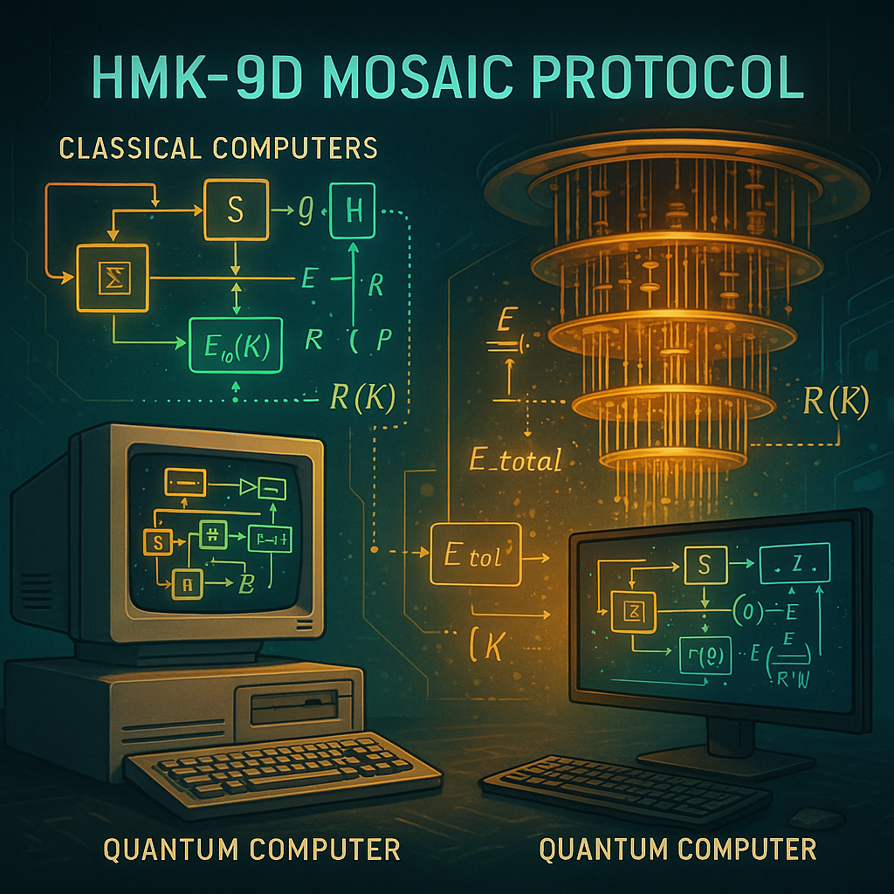
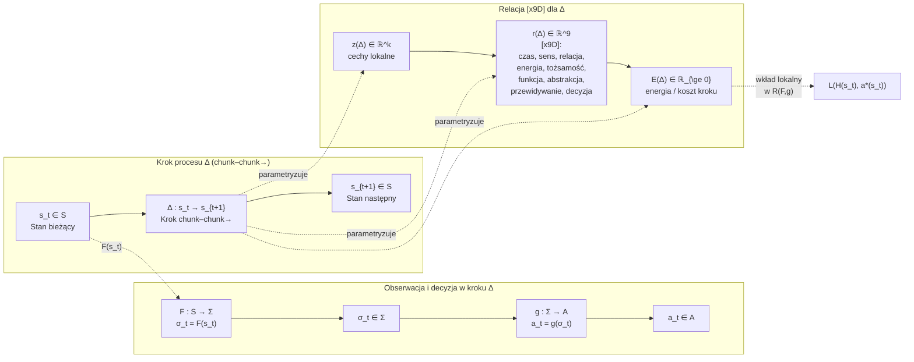

# Wprowadzenie – Protokół HoloMozaikowej Kompresji 9D (HMK-9D 4 GlitchLab)

<p align="center">
  
</p>

Współczesne systemy Human–AI funkcjonują nie jako pojedyncze, statyczne automaty decyzyjne, lecz jako gęste, wielowarstwowe sieci procesów, w których kolejne decyzje nadpisują siebie wzajemnie w czasie. Klasyczny obraz opiera się na polityce

$$
\pi(a \mid s),
$$

w której stan $$s \in S$$ przechodzi w działanie $$a \in A$$ zgodnie z ustaloną regułą. Ten opis jest konieczny, ale niewystarczający: nie mówi nic o **geometrii protokołu**, czyli o tym, jak system:

* porcjuje strumień zdarzeń w kroki typu `chunk–chunk→`,
* układa te kroki w trajektorie,
* kształtuje relacje między krokami,
* rozkłada globalny błąd $$R(F,g)$$ względem dolnej granicy $$R^*(K)$$ na lokalne wkłady.

Protokół HoloMozaikowej Kompresji 9D (HMK-9D) dopełnia ten brak. Nie zastępuje kontraktu

$$ \big(S, \Sigma, A, F, g, H, a^*\big),$$

lecz wprowadza nad nim **warstwę organizującą**, w której proces jest widziany jako ciąg kroków $$\Delta$$ osadzonych w przestrzeni stanów, z jawnie modelowaną strukturą relacji między nimi.

Każdy krok

$$\Delta : s_t \to s_{t+1} $$

jest minimalnym przejściem typu `chunk–chunk→`: stan $$s_t$$ zostaje skompresowany przez $$F : S \to \Sigma$$, przetworzony przez politykę $$g : \Sigma \to A$$, a wynikowe działanie aktualizuje stan do $$s_{t+1}$$. Zamiast traktować ten krok jako czarną skrzynkę, HMK-9D rozkłada go na:

* wektor cech lokalnych
  $$z(\Delta) \in \mathbb{R}^k,$$
* wektor relacji (inwariant 9D)
  $$r(\Delta) \in \mathbb{R}^9,$$
* lokalną energię kroku
  $$E(\Delta) \in \mathbb{R}_{\ge 0}.$$

Wektor

$$r(\Delta) = [x9D]$$

opisuje rozkład obciążenia w dziewięciu wymiarach: czasu, sensu, relacji, energii poznawczej, tożsamości roli, funkcji (mandatu), poziomu abstrakcji, przewidywania oraz decyzji–tokenu. Znak $$[x9D]$$ jest **inwariantem kompresji**: minimalnym zestawem współrzędnych, które pozostają stabilne po przejściu przez $$F$$ i nadal pozwalają polityce $$g$$ wybrać działanie bliskie idealnemu $$a^*$$.

Lokalna energia kroku może być odczytywana jako przybliżenie lokalnej straty:

$$E(\Delta) ;\approx; L\big(H(s_t), a^*(s_t)\big),$$

a globalna energia mozaiki

$$E_{\text{total}} ;=; \sum_{\Delta} E(\Delta)$$

staje się mozaikową aproksymacją globalnego ryzyka $$R(F,g)$$ — ale już **z informacją o tym, gdzie** w trajektorii ten koszt powstaje.

Relacje między krokami są w HMK-9D obiektami pierwszej klasy. Trajektoria

$$s_0 \to s_1 \to s_2 \to \dots$$

jest widziana jako szereg kroków $$\Delta_0, \Delta_1, \dots$$, połączonych nie tylko strzałkami czasowymi, ale także:

* **stałymi mostami semantycznymi** oznaczanymi znakiem „–”, np.
  `Plan–Pauza`, `Rdzeń–Peryferia`, `Cisza–Wydech`, które definiują **osie kompresji** – stabilne pary biegunów, wzdłuż których porządkowane są wektory $$r(\Delta)$$,
* **progami przejścia** oznaczanymi znakiem „‡”, które wyznaczają miejsca zmiany reżimu: inny dopuszczalny błąd, inne ważenie wymiarów $$[x9D]$$, inną interpretację energii $$E(\Delta)$$ w bilansie globalnym.

Zbiór kroków z danego epizodu tworzy **mozaikowe pole sterowania**: do każdego indeksu $$i \in I$$ przypisujemy trójkę

$$\Phi(i) = \big(z_i, r_i, E_i\big),$$

co daje dyskretne pole

$$\Phi : I \to \mathbb{R}^k \times \mathbb{R}^9 \times \mathbb{R}_{\ge 0}.$$

Sterowanie systemem polega wtedy nie na pojedynczej globalnej komendzie, lecz na **przełączaniu i przegrupowywaniu kafelków mozaiki** tak, aby konfiguracja minimalizowała $$E_{\text{total}}$$ w granicach wyznaczonych przez $$R^*(K)$$. Intuicja jest bliska „mosaic warfare”: sterujesz strukturą kafelków, a nie tylko lokalnymi ruchami.

---

## Schemat działania protokołu HMK-9D

Ogólny schemat HMK-9D można zapisać jako warstwę nakładaną na klasyczny kontrakt decyzyjny:



1. **Poziom kontraktu (nagie S, Σ, A, F, g, H, a\*).**
   Ustalone są:

   * przestrzeń stanów $$S$$,
   * alfabet obserwacji $$\Sigma$$,
   * przestrzeń działań $$A$$,
   * funkcja kompresji
     $$F : S \to \Sigma,$$
   * polityka decyzyjna
     $$g : \Sigma \to A,$$
   * zachowanie
     $$H = g \circ F,$$
   * idealna polityka 
     $$a^{\ast}$$ 
     i ryzyko 
     $$R(F,g)$$ 
     z dolną granicą 
     $$R^{\ast}(K).$$

2. **Poziom kroków Δ (chunk–chunk→).**
   Strumień stanów jest porcjowany na minimalne przejścia

   $$\Delta_i : s_i \to s_{i+1},$$

   tak aby każdy krok odpowiadał pojedynczemu zdarzeniu w sensie protokołu `chunk–chunk→`.


3. **Poziom inwariantu 9D.**
   Dla każdego kroku wyznaczane są:

   * cechy lokalne $$z(\Delta_i) \in \mathbb{R}^k,$$
   * wektor relacji $$r(\Delta_i) \in \mathbb{R}^9 = [x9D],$$
   * lokalna energia $$E(\Delta_i) \in \mathbb{R}_{\ge 0}.$$

   Wektory $$r(\Delta_i)$$ są interpretowane przez stały słownik osi 9D (czas, sens, relacja, energia, tożsamość, funkcja, abstrakcja, przewidywanie, decyzja–token).

4. **Poziom mozaiki Φ.**
   Rodzina kroków tworzy pole

  $$
  \Phi(i) = \big(z_i, r_i, E_i\big),
  \qquad i \in I,
  $$
  
  a globalna energia
  
  $$
  E_{\text{total}} = \sum_{i \in I} E_i
  $$
  
  stanowi mozaikową reprezentację ryzyka \(R(F,g)\).

5. **Poziom mostów i progów.**
   Na mozaikę nakładany jest stały zestaw mostów semantycznych (np. `Plan–Pauza`, `Rdzeń–Peryferia`, `Wioska–Miasto`, `Human–AI`) i progów `‡`, które:

   * definiują preferowane kierunki zmian wektorów $$r(\Delta)$$,
   * sterują przejściami między reżimami (różne ważenie osi $$[x9D]$$, różne limity energii),
   * wprowadzają punkty bez powrotu (commit / zapis do historii systemu).

6. **Poziom microcode / HMK9D_VM.**
   Dla powtarzalnych procesów (np. run GlitchLab, analiza wątku, deploy) definiowane są programy microcode, które sekwencjonują:

   * operacje segmentacji (`CHUNK_SEG`),
   * zastosowanie mostów (`APPLY_BRIDGE`),
   * akumulację energii (`ACCUM_ENERGY`),
   * wejście w próg i commit (`ENTER_GATE`, `COMMIT_IF_OK`),
   * sprzężenie zwrotne (`FEEDBACK_UPDATE`, `EMIT_STEP_EVENT`).

   Maszyna HMK-9D aktualizuje rejestr stanu 9D, liczy $$E(\Delta)$$ oraz publikuje zdarzenia do warstwy danych (EGDB GlitchLab), gdzie mozaika Φ może być analizowana jak realne pole sterowania.

Ten schemat stanowi warstwę „0-ro”: pomost między czystą teorią kontraktu decyzyjnego a szczegółową definicją kroków, energii i mostów, która pojawi się w następnych częściach.


## 0. Dlaczego sam kontrakt $$\big(S, \Sigma, A, F, g, H, a^*\big)$$ nie wystarcza

W klasycznych ujęciach uczenia maszynowego i teorii decyzji system opisuje się jako maszynę decyzyjną operującą na przestrzeni stanów. Mamy więc:

* przestrzeń stanów $$S$$,
* alfabet obserwacji $$\Sigma$$,
* przestrzeń działań $$A$$,
* funkcję kompresji (obserwacji)
  $$F : S \to \Sigma,$$
* politykę decyzyjną
  $$g : \Sigma \to A.$$

Złożenie

$$
H := g \circ F : S \to A
$$

opisuje rzeczywiste zachowanie systemu, a funkcja straty

$$
L : A \times A \to \mathbb{R}_{\ge 0}
$$

pozwala zdefiniować globalne ryzyko

$$
R(F,g) ;=; \mathbb{E}_{s \sim P}\Big[L\big(H(s), a^*(s)\big)\Big],
$$

gdzie idealna polityka

$$
a^* : S \to A
$$

pełni rolę niedostępnego punktu odniesienia.

To ujęcie jest matematycznie poprawne, ale **płaskie**. Nie mówi nic o tym, jak system:

1. **porcjuje proces w czasie** – czy decyzje powstają w małych krokach, czy w dużych blokach;
2. **układa trajektorię decyzji** – które kroki są techniczne, a które normatywne;
3. **przenosi błąd lokalny na poziom globalny** – gdzie w łańcuchu powstaje koszt, a gdzie tylko się propaguje;
4. **kontroluje energię poznawczą i inżynieryjną** – ile „wysiłku” wymaga podjęcie konkretnej decyzji.

Kontrakt
$$\big(S, \Sigma, A, F, g, H, a^*\big)$$
pozwala policzyć średnie ryzyko $$R(F,g)$$, ale:

* nie rozróżnia kroku typu „dopisz komentarz w kodzie” od kroku „zmień politykę bezpieczeństwa” – oba są tylko innymi wartościami w $$A$$,
* nie wskazuje, które fragmenty trajektorii są **krytyczne strukturalnie** (progi, commity, zmiana reżimu),
* nie ma pojęcia **geometrii procesu**: nie widzi mozaiki kroków, tylko punktowy mapping

$$
s \mapsto H(s).
$$

Protokół HoloMozaikowej Kompresji 9D (HMK-9D) jest nadbudową nad tym kontraktem. Zamiast zmieniać samą definicję ryzyka, HMK-9D:

* **jawnie wprowadza kroki procesu**
  $$\Delta : s_t \to s_{t+1},$$
  które odpowiadają minimalnym przejściom typu `chunk–chunk→` w kontekście Human–AI,

* do każdego kroku przypisuje:

  * wektor cech lokalnych
    $$z(\Delta) \in \mathbb{R}^k,$$
  * wektor relacji (inwariant 9D)
    $$r(\Delta) \in \mathbb{R}^9,$$
  * energię kroku
    $$E(\Delta) \in \mathbb{R}_{\ge 0},$$

* **układa kroki w mozaikę**
  $$\Phi : I \to \mathbb{R}^k \times \mathbb{R}^9 \times \mathbb{R}_{\ge 0},\qquad \Phi(i) = \big(z_i, r_i, E_i\big),$$
  gdzie $$I$$ jest zbiorem indeksów kroków w rozpatrywanym epizodzie.

Wtedy globalną energię mozaiki definiujemy jako

$$
E_{\text{total}} := \sum_{i \in I} E_i,
$$

a HMK-9D traktuje

$$
E_{\text{total}} \approx R(F,g)
$$


jako **mozaikową aproksymację** klasycznego ryzyka: nie tylko wiemy *ile* wynosi średni koszt, ale także *gdzie* w trajektorii on powstaje.

Intuicja jest następująca:

> klasyczny kontrakt decyzyjny mówi, *jakie* jest ryzyko średnie,
> HMK-9D mówi dodatkowo, *gdzie w procesie* powstaje koszt
> i *jak jest rozłożony* w mozaice kroków `chunk–chunk→`.

W GlitchLab taki opis nie jest metaforą, ale **narzędziem inżynierskim**. Pozwala:

* traktować wątki konwersacyjne, logi, commity jako trajektorie w $$S$$,
* mierzyć obciążenie **mostów semantycznych** (Plan–Pauza, Wioska–Miasto, Human–AI, …),
* projektować generatory i roje agentów tak, aby nie tylko minimalizowały błąd,
  ale utrzymywały proces w akceptowalnych reżimach energii i odpowiedzialności.

---

## 1. Rdzeń formalny: kontrakt decyzyjny w wersji „nagiej”

Zanim nałożymy na kontrakt geometrię HMK-9D, potrzebujemy czystej, minimalistycznej definicji, która nie odwołuje się do psychologii, metafor ani architektury systemowej. W tej sekcji pracujemy wyłącznie na poziomie zbiorów i funkcji.

### 1.1. Przestrzeń stanów $$S$$

Przez $$S$$ oznaczamy pełną przestrzeń stanów systemu Human–AI, który analizujemy. Pojedynczy stan

$$
s \in S
$$

może zawierać równocześnie:

* wewnętrzny stan modelu (ukryte wektory, cache, zegary, stany narzędzi),
* stan środowiska zewnętrznego (otwarte pliki, konfigurację sieci, zawartość repozytorium),
* historię dotychczasowych interakcji (logi rozmów, historię commitów, decyzje użytkownika).

W HMK-9D **nie rozbijamy** $$S$$ na podskładniki. Traktujemy je jako „pełny stan rzeczy”, który idealny obserwator mógłby zobaczyć **przed** kompresją.

### 1.2. Alfabet obserwacji $$\Sigma$$

Przez $$\Sigma$$ oznaczamy alfabet sygnałów, które mogą trafić do polityki decyzyjnej. Pojedynczy symbol

$$
\sigma \in \Sigma
$$

może reprezentować:

* token tekstowy (słowo, jego fragment),
* symbol sterujący (np. znacznik `[LINUX]` w HUD-zie),
* skrót techniczny (np. `"HMK-9D"`, znak progu `‡`, nazwa mostu `Plan–Pauza`),
* agregat kilku tokenów interpretowany jako jedna jednostka decyzyjna.

Kompresja stanu zachodzi właśnie do $$\Sigma$$ – wszystko, czego **nie da się odtworzyć** z $$\sigma$$, jest z punktu widzenia decyzji **utracone**.

Formalnie:

$$
F : S \to \Sigma,
\qquad
\sigma = F(s).
$$

### 1.3. Przestrzeń działań $$A$$

Przez $$A$$ oznaczamy zbiór wszystkich dopuszczalnych działań systemu. Element

$$
a \in A
$$

może być:

* wypowiedzią tekstową (odpowiedź LLM-a),
* akcją techniczną (zapis pliku, wywołanie skryptu, zapytanie SQL),
* sygnałem metakognitywnym („poproś o doprecyzowanie”, „wstrzymaj odpowiedź”),
* decyzją pasywną („brak odpowiedzi”).

Definicja $$A$$ jest niezależna od implementacji (LLM, system regułowy, hybryda). Interesuje nas tylko to, że **dla każdej** obserwacji $$\sigma$$ można wybrać jakieś działanie $$a$$.

### 1.4. Funkcja kompresji $$F : S \to \Sigma$$

Funkcja kompresji

$$
F : S \to \Sigma
$$

jest **jedynym dozwolonym oknem** na stan. Dla każdego

$$
s \in S
$$

obserwator widzi wyłącznie

$$
\sigma = F(s).
$$

W praktyce $$F$$ może obejmować:

* tokenizację i embedding,
* wybór fragmentów kontekstu (np. RAG, pamięć profilu, PCE),
* filtry bezpieczeństwa (usuwanie informacji niedozwolonych).

W HMK-9D będziemy dodatkowo interpretować $$F$$ jako mechanizm **porcjowania trajektorii** na kroki `chunk–chunk→`, ale na tym etapie pozostajemy przy czystym formalizmie: $$F$$ zachowuje tyle informacji, ile wystarcza polityce $$g$$ do działania.

### 1.5. Polityka działania $$g : \Sigma \to A$$

Polityka

$$
g : \Sigma \to A
$$

jest **jedynym dozwolonym mechanizmem decyzyjnym**. Dla każdej obserwacji $$\sigma$$ wyznacza działanie

$$
a = g(\sigma).
$$

Kluczowe ograniczenie:

* $$g$$ **nie widzi** pełnego stanu $$s$$,
* operuje wyłącznie na zredukowanej reprezentacji
  $$\sigma = F(s).$$

Każda utrata informacji na poziomie $$F$$ musi zostać:

* odpracowana konstrukcją $$g$$, albo
* zaakceptowana jako **nieusuwalny składnik błędu**.

### 1.6. Rzeczywiste zachowanie $$H = g \circ F$$ i nieusuwalne ryzyko

Złożenie rzeczywistego zachowania systemu zapisujemy najpierw w klasycznej, „podręcznikowej” postaci typu i definicji:

$$
H : S \to A,
\qquad
H := g \circ F.
$$

Równoważnie, w skróconym zapisie użytecznym w kontekście informatycznym możemy pisać:

$$
H := g \circ F : S \to A.
$$

W obu przypadkach sens jest ten sam: funkcja $$H$$ jest złożeniem kompresji $$F : S \to \Sigma$$ i polityki $$g : \Sigma \to A$$, więc jej typ to $$S \to A$$.

Dla danego stanu $$s \in S$$ mamy więc:

$$
H(s) = g\big(F(s)\big).
$$

To właśnie $$H$$ podlega ocenie w kategoriach ryzyka względem idealnej polityki $$a^* : S \to A$$.

Niech funkcja straty

$$
L : A \times A \to \mathbb{R}_{\ge 0}
$$

mierzy „odległość” pomiędzy działaniem rzeczywistym a idealnym. Przy rozkładzie stanów $$P$$ na $$S$$ globalne ryzyko definiujemy jako

$$
R(F,g) := \mathbb{E}_{s \sim P}\Big[L\big(H(s), a^*(s)\big)\Big].
$$

Jeżeli dodatkowo rozważamy klasę dopuszczalnych par

$$
(F,g) \in K,
$$

to **optymalne ryzyko Bayesowskie** (dolną granicę błędu) określamy jako

$$
R^*(K) := \inf_{(F,g) \in K} R(F,g).
$$

Dla każdej konkretnej pary $$(F,g)$$ zachodzi zatem

$$
R(F,g) \ge R^*(K).
$$

### 1.7. Mozaikowe pole DARPA jako pole sterowania

Mając zdefiniowany kontrakt

$$
\big(S, \Sigma, A, F, g, H, a^*\big)
$$

oraz lokalne wielkości

$$
z(\Delta) \in \mathbb{R}^k, \qquad
r(\Delta) \in \mathbb{R}^9, \qquad
E(\Delta) \in \mathbb{R}_{\ge 0},
$$

możemy przejść od pojedynczych kroków $$\Delta$$ do poziomu **mozaiki epizodu**.

Niech $$I$$ będzie zbiorem indeksów kroków w pewnym skończonym epizodzie (np. jednej rozmowie, jednym przebiegu systemu, jednej sesji GlitchLab). Dla każdego

$$
i \in I
$$

mamy krok


$$
\Delta_i : s_t \to s_{t+1}
$$

oraz odpowiadające mu wielkości

$$
z_i := z(\Delta_i), \qquad
r_i := r(\Delta_i), \qquad
E_i := E(\Delta_i).
$$

Definiujemy wtedy **mozaikowe pole sterowania** jako odwzorowanie

$$
\Phi : I \to \mathbb{R}^k \times \mathbb{R}^9 \times \mathbb{R}_{\ge 0},
\qquad
\Phi(i) := \big(z_i, r_i, E_i\big).
$$

Każdy indeks $$i$$ odpowiada pojedynczemu „kafelkowi” mozaiki – lokalnej decyzji typu `chunk–chunk→`, osadzonej w przestrzeni stanów $$S$$ i opisanej przez:

* $$z_i$$ – **lokalną geometrię sygnału** (co się faktycznie dzieje w tym fragmencie trajektorii),
* $$r_i$$ – **konfigurację inwariantu 9D** $$[x9D]$$ (które wymiary są obciążone: czas, sens, relacja, energia, rola, mandat, abstrakcja, przewidywanie, decyzja–token),
* $$E_i$$ – **lokalny koszt** tego kroku (łączący błąd decyzyjny, energię poznawczą i koszt systemowy).

Globalną energię mozaiki w epizodzie definiujemy jako sumę lokalnych wkładów:

$$
E_{\text{total}} := \sum_{i \in I} E_i.
$$

Jeżeli część decyzyjna energii $$E_i$$ jest dobrana tak, aby przybliżać lokalną stratę

$$
L\big(H(s_i), a^*(s_i)\big),
$$

to średnia energia na krok

$$
\widehat{R}_{\text{ep}}(F,g)
:=
\frac{1}{\lvert I \rvert}
\sum_{i \in I} E_i
$$

jest **empiryczną mozaikową aproksymacją** klasycznego ryzyka $$R(F,g)$$ w tym epizodzie:

$$
\widehat{R}_{\text{ep}}(F,g) \approx R(F,g),
$$

a suma

$$
E_{\text{total}} = \lvert I \rvert \cdot \widehat{R}_{\text{ep}}(F,g)
$$


może być odczytywana jako „ile kosztowała” dana trajektoria – w sensie błędu, energii poznawczej i zasobów technicznych.


W tym sensie zależność

$$
E_{\text{total}} \approx R(F,g)
$$

nie oznacza równości analitycznej, lecz **związek między dwoma poziomami opisu**:

* $$R(F,g)$$ – poziom **statystyczny**, definiowany względem rozkładu $$P$$ na całej przestrzeni stanów $$S$$ (granica przy nieskończonej liczbie epizodów),
* $$E_{\text{total}}$$ i $$\widehat{R}_{\text{ep}}(F,g)$$ – poziom **mozaikowy**, liczony na konkretnym epizodzie jako suma i średnia z energii kroków $$E_i$$.

Dzięki temu HMK-9D pozwala nie tylko stwierdzić, że „system ma ryzyko $$R(F,g)$$”, ale też zobaczyć **gdzie** w mozaice trajektorii to ryzyko się materializuje: w jakich krokach, pod jakimi mostami (np. `Plan–Pauza`, `Wioska–Miasto`, `Human–AI`), przy jakim obciążeniu osi $$[x9D]$$.

W duchu „mosaic warfare” sterowanie systemem polega wtedy nie na pojedynczej globalnej komendzie, lecz na **przełączaniu i przegrupowywaniu kafelków** mozaiki $$\Phi$$:

* zmianie kolejności i routingu kroków $$\Delta_i$$,
* zmianie reżimów (progi `‡`, inne ważenie współrzędnych w $$r_i$$),
* wprowadzaniu lub usuwaniu całych klas kroków (np. agentów, modułów, polityk),

tak, aby konfiguracja mozaiki minimalizowała $$E_{\text{total}}$$ w granicach wyznaczonych przez dolną granicę $$R^*(K)$$:

$$
E_{\text{total}} \ge \lvert I \rvert \cdot R^*(K),
$$

a praktycznie – aby empiryczna miara

$$
\widehat{R}_{\text{ep}}(F,g)
$$

zbliżała się do $$R^*(K)$$, zamiast dryfować w stronę chaotycznego, niekontrolowanego wzrostu energii.

---

## 2. Dowód przez konstrukcję: HMK-9D jako warstwa AST + microcode + YAML

W tej części przechodzimy od czystej teorii do **dowodu przez konstrukcję**: pokazujemy, że protokół HMK-9D można zrealizować jako konkretny silnik Pythona, który:

1. czyta **kod źródłowy** (repozytorium) i buduje z niego **AST**,
2. interpretuje ten AST przez **soczewki HMK-9D** opisane w YAML,
3. wykonuje **program microcode** (HMK9D_VM), który steruje chunkizacją, mapowaniem `[x9D]`, wyznaczaniem progów `‡` i liczeniem energii `E(Δ)`,
4. emituje **mozaikę Φ** jako uporządkowany zbiór kroków `Δ`, z których każdy ma swój wektor `[x9D]` i energię `E(Δ)`.

W ten sposób każdemu obiektowi w repozytorium (funkcji, klasie, plikowi, modułowi) można przypisać **kod DNA HMK-9D**: podpis `[x9D]`, typ roli (Plan–Pauza, Wioska–Miasto, Human–AI, …) i miejsce w mozaice Φ.

To, że taki silnik da się zdefiniować, stanowi **dowód konstruktywny**, że HMK-9D nie jest tylko metaforą, ale implementowalną geometrią dla środowiska, które samo siebie postrzega i ewoluuje.

---

### 2.1. Rdzeń danych: `[x9D]`, soczewki i kroki mozaiki

Zaczynamy od zdefiniowania podstawowych typów danych HMK-9D: wektora `[x9D]`, „soczewki” (lensa) oraz kroku `Δ` w mozaice kodu.

```python
# hmk9d_core.py
from __future__ import annotations

from dataclasses import dataclass, field
from typing import Dict, Any, List, Tuple, Optional
from uuid import uuid4


@dataclass(frozen=True)
class X9D:
    """Inwariant 9D [x9D] dla pojedynczego kroku Δ."""
    time: float              # czas / rytm
    meaning: float           # sens / semantyka
    relation: float          # relacyjność
    cognitive_energy: float  # energia poznawcza
    identity: float          # tożsamość / rola
    mandate: float           # mandat / funkcja
    abstraction: float       # poziom abstrakcji
    prediction: float        # przewidywanie
    decision: float          # decyzja–token

    def as_vector(self) -> Tuple[float, ...]:
        return (
            self.time, self.meaning, self.relation, self.cognitive_energy,
            self.identity, self.mandate, self.abstraction,
            self.prediction, self.decision,
        )


@dataclass
class Lens:
    """
    Soczewka HMK-9D: opisuje jak interpretować dany fragment AST
    w kategoriach [x9D] oraz jaką rolę mostu pełni.
    """
    name: str                      # np. "Plan–Pauza"
    applies_to: List[str]          # typy AST: ["FunctionDef", "AsyncFunctionDef"]
    base_x9d: X9D                  # bazowy wektor [x9D]
    weight: float = 1.0            # waga soczewki w mieszance
    description: str = ""          # opis roli w systemie
    tags: List[str] = field(default_factory=list)


@dataclass
class MosaicStep:
    """
    Pojedynczy krok Δ w mozaice AST: fragment kodu + [x9D] + energia E(Δ).
    """
    id: str
    module: str
    filename: str
    node_type: str
    lineno: int
    col_offset: int
    span: Tuple[int, int]          # (początek, koniec w pliku)
    x9d: X9D
    energy: float
    lenses: List[str]              # nazwy aktywnych soczewek
    metadata: Dict[str, Any] = field(default_factory=dict)

    def as_record(self) -> Dict[str, Any]:
        return {
            "id": self.id,
            "module": self.module,
            "filename": self.filename,
            "node_type": self.node_type,
            "lineno": self.lineno,
            "col_offset": self.col_offset,
            "span": self.span,
            "x9d": list(self.x9d.as_vector()),
            "energy": self.energy,
            "lenses": self.lenses,
            "metadata": self.metadata,
        }
```

Na tym poziomie:

* `[x9D]` jest **konkretnym wektorem liczb** przypisanym do kroku `Δ`,
* `Lens` jest **implementacją mostu** (np. `Plan–Pauza`) na poziomie kodu – mówi, jakie typy AST „widzi” i jak domyślnie ustawia `[x9D]`,
* `MosaicStep` jest **jednostką mozaiki Φ**: odpowiada fragmentowi AST, ma swój `[x9D]`, energię `E(Δ)` i listę soczewek, przez które został zobaczony.

---

### 2.2. YAML: soczewki, progi i program microcode

Definicje soczewek, progów `‡` oraz programu microcode trzymamy w pliku YAML – to jest warstwa, którą można modyfikować bez ruszania kodu.

```yaml
# hmk9d_config.yaml
hmk9d:
  lenses:
    - name: "Plan–Pauza"
      applies_to: ["FunctionDef", "AsyncFunctionDef"]
      description: "Soczewka planowania / pauzy: definicje funkcji => plan."
      tags: ["planowanie", "architektura"]
      x9d:
        time: 0.8
        meaning: 0.9
        relation: 0.4
        cognitive_energy: 0.7
        identity: 0.6
        mandate: 0.9
        abstraction: 0.8
        prediction: 0.5
        decision: 0.6

    - name: "Wioska–Miasto"
      applies_to: ["ClassDef", "Module"]
      description: "Soczewka skali: klasy / moduły jako wioska/miasto."
      tags: ["skala", "organizacja"]
      x9d:
        time: 0.5
        meaning: 0.8
        relation: 0.7
        cognitive_energy: 0.6
        identity: 0.9
        mandate: 0.7
        abstraction: 0.9
        prediction: 0.4
        decision: 0.6

    - name: "Human–AI"
      applies_to: ["Call"]
      description: "Wezwania do AI / API / IO jako oś Human–AI."
      tags: ["interakcja", "wejście-wyjście"]
      x9d:
        time: 0.6
        meaning: 0.8
        relation: 0.9
        cognitive_energy: 0.7
        identity: 0.7
        mandate: 0.8
        abstraction: 0.6
        prediction: 0.8
        decision: 0.9

  thresholds:
    - name: "Próg–Przejście/commit"
      description: "Commit strukturalny: duże klasy / moduły."
      condition: "node_type in ['ClassDef','Module'] and loc >= 50"
      action: "mark_gate"

  microcode:
    - op: "CHUNK_AST"
      args:
        granularity: "stmt"   # "stmt" | "def" | "block"
    - op: "MAP_LENSES"
    - op: "ACCUM_ENERGY"
    - op: "MARK_GATES"
    - op: "EMIT_MOSAIC"
```

W tym YAML-u:

* sekcja `lenses` definiuje **platformowe soczewki** (`Plan–Pauza`, `Wioska–Miasto`, `Human–AI`) wraz z ich `[x9D]`,
* sekcja `thresholds` koduje **progi `‡`** – tu: duże klasy / moduły są oznaczane jako punkty `Próg–Przejście`,
* sekcja `microcode` jest **programem HMK9D_VM**: mówi, w jakiej kolejności AST ma być chunkizowany, przepuszczany przez soczewki i zamieniany w mozaikę Φ.

---

### 2.3. Microcode jako PROMOT ASCII dla AST

Program microcode możemy przedstawić także jako tablicę PROMOT ASCII – to jest „mikroinstrukcja” dla HMK9D_VM:

```text
+----------+-----------+----------------------------------------+------------------------------------------+
| OPC      | SYM       | Δ-OP                                   | L-SIG                                    |
+----------+-----------+----------------------------------------+------------------------------------------+
| S0       | ::CHUNK   | zamień AST na kroki Δ (węzły/stmt)     | "potnij kod na stabilne kroki"          |
| S1       | ::LENS    | do Δ przypisz soczewki i [x9D]         | "przepuść przez soczewki HMK-9D"        |
| S2       | ::ENERGY  | policz E(Δ) dla każdego kroku          | "zmierz koszt kroku w 9D"               |
| S3       | ::GATE    | oznacz progi ‡ wg reguł z thresholdów  | "zaznacz commit / Próg–Przejście"       |
| S4       | ::EMIT    | wyemituj mozaikę Φ jako strukturę danych| "zapisz pole sterowania dla GlitchLab" |
+----------+-----------+----------------------------------------+------------------------------------------+
```

To dokładnie odpowiada sekcji `microcode` w YAML; HMK9D_VM odczytuje YAML i wykonuje kolejne operacje `S0 → S1 → S2 → S3 → S4`.

---

### 2.4. Silnik HMK-9D dla AST: ładowanie YAML i budowa Φ

Kolejny krok dowodu to zdefiniowanie silnika, który:

1. ładuje YAML,
2. kompiluje soczewki i progi,
3. przetwarza AST Pythona,
4. generuje listę `MosaicStep` – czyli **mozaikę Φ kodu**.

```python
# hmk9d_ast_engine.py
from __future__ import annotations

import ast
import inspect
import textwrap
from dataclasses import dataclass
from pathlib import Path
from typing import Any, Dict, List

import yaml

from hmk9d_core import X9D, Lens, MosaicStep


@dataclass
class Threshold:
    name: str
    description: str
    condition: str   # wyrażenie w mini-DSL (eval na kontekście kroku)
    action: str      # np. "mark_gate"


@dataclass
class MicroOp:
    op: str
    args: Dict[str, Any]


@dataclass
class HMK9DConfig:
    lenses: List[Lens]
    thresholds: List[Threshold]
    microcode: List[MicroOp]


class HMK9DASTEngine:
    """
    Silnik HMK-9D dla AST: realizuje microcode na drzewie składniowym Pythona.
    """

    def __init__(self, config: HMK9DConfig) -> None:
        self.config = config

    @classmethod
    def from_yaml(cls, path: Path) -> "HMK9DASTEngine":
        data = yaml.safe_load(path.read_text(encoding="utf-8"))["hmk9d"]

        lenses: List[Lens] = []
        for raw in data.get("lenses", []):
            x9 = raw["x9d"]
            lens = Lens(
                name=raw["name"],
                applies_to=raw["applies_to"],
                description=raw.get("description", ""),
                tags=raw.get("tags", []),
                base_x9d=X9D(
                    time=x9["time"],
                    meaning=x9["meaning"],
                    relation=x9["relation"],
                    cognitive_energy=x9["cognitive_energy"],
                    identity=x9["identity"],
                    mandate=x9["mandate"],
                    abstraction=x9["abstraction"],
                    prediction=x9["prediction"],
                    decision=x9["decision"],
                ),
            )
            lenses.append(lens)

        thresholds: List[Threshold] = []
        for raw in data.get("thresholds", []):
            thresholds.append(
                Threshold(
                    name=raw["name"],
                    description=raw.get("description", ""),
                    condition=raw["condition"],
                    action=raw["action"],
                )
            )

        microcode: List[MicroOp] = []
        for raw in data.get("microcode", []):
            microcode.append(
                MicroOp(
                    op=raw["op"],
                    args=raw.get("args", {}),
                )
            )

        return cls(HMK9DConfig(lenses=lenses, thresholds=thresholds, microcode=microcode))

    # -------------------- Główne API --------------------

    def analyze_module_source(
        self,
        source: str,
        filename: str = "<memory>",
        module: str = "<module>",
    ) -> List[MosaicStep]:
        """
        Główna funkcja: bierze kod źródłowy, wykonuje program microcode
        i zwraca listę kroków Δ, czyli mozaikę Φ.
        """
        tree = ast.parse(source, filename=filename)
        context: Dict[str, Any] = {
            "tree": tree,
            "filename": filename,
            "module": module,
            "steps": [],  # zostanie wypełnione przez microcode
        }

        for micro_op in self.config.microcode:
            if micro_op.op == "CHUNK_AST":
                self._op_chunk_ast(context, **micro_op.args)
            elif micro_op.op == "MAP_LENSES":
                self._op_map_lenses(context)
            elif micro_op.op == "ACCUM_ENERGY":
                self._op_accum_energy(context)
            elif micro_op.op == "MARK_GATES":
                self._op_mark_gates(context)
            elif micro_op.op == "EMIT_MOSAIC":
                # nic nie robi, steps są już gotowe
                pass
            else:
                raise ValueError(f"Nieznana operacja microcode: {micro_op.op}")

        return context["steps"]

    # -------------------- Operacje microcode --------------------

    def _op_chunk_ast(self, context: Dict[str, Any], granularity: str = "stmt") -> None:
        """
        CHUNK_AST: zamienia AST na kroki Δ (węzły).
        Można sterować granulacją (instrukcje, definicje, bloki).
        """
        tree: ast.AST = context["tree"]
        filename: str = context["filename"]
        module: str = context["module"]

        steps: List[MosaicStep] = []

        for node in ast.walk(tree):
            node_type = type(node).__name__
            if not hasattr(node, "lineno"):
                continue

            lineno = getattr(node, "lineno", 0)
            col = getattr(node, "col_offset", 0)
            end_lineno = getattr(node, "end_lineno", lineno)
            span = (lineno, end_lineno)

            # placeholder [x9D] – zostanie wypełniony przez MAP_LENSES
            zero = X9D(
                time=0.0,
                meaning=0.0,
                relation=0.0,
                cognitive_energy=0.0,
                identity=0.0,
                mandate=0.0,
                abstraction=0.0,
                prediction=0.0,
                decision=0.0,
            )

            step = MosaicStep(
                id=str(uuid4()),
                module=module,
                filename=filename,
                node_type=node_type,
                lineno=lineno,
                col_offset=col,
                span=span,
                x9d=zero,
                energy=0.0,
                lenses=[],
                metadata={"node_repr": ast.dump(node, annotate_fields=False, include_attributes=False)},
            )
            steps.append(step)

        context["steps"] = steps

    def _op_map_lenses(self, context: Dict[str, Any]) -> None:
        """
        MAP_LENSES: dla każdego kroku Δ wybiera soczewki i wylicza [x9D].
        """
        steps: List[MosaicStep] = context["steps"]
        lenses = self.config.lenses

        for step in steps:
            active: List[Lens] = [
                lens for lens in lenses if step.node_type in lens.applies_to
            ]
            if not active:
                continue

            # średnia ważona [x9D] ze wszystkich aktywnych soczewek
            acc = [0.0] * 9
            total_w = 0.0
            for lens in active:
                vec = lens.base_x9d.as_vector()
                w = lens.weight
                total_w += w
                for i, v in enumerate(vec):
                    acc[i] += w * v

            if total_w > 0:
                acc = [v / total_w for v in acc]

            step.x9d = X9D(*acc)
            step.lenses = [lens.name for lens in active]

    def _op_accum_energy(self, context: Dict[str, Any]) -> None:
        """
        ACCUM_ENERGY: definiuje energię E(Δ) jako prostą funkcję [x9D] + rozmiaru węzła.
        W produkcji można ją zastąpić modelowaną funkcją straty.
        """
        steps: List[MosaicStep] = context["steps"]

        for step in steps:
            v = step.x9d.as_vector()
            # heurystyka: energia = norma L1 [x9D] * log(rozmiar fragmentu)
            base = sum(abs(x) for x in v)
            loc = max(1, step.span[1] - step.span[0] + 1)
            step.energy = base * (1.0 + 0.1 * (loc ** 0.5))
            step.metadata["loc"] = loc

    def _op_mark_gates(self, context: Dict[str, Any]) -> None:
        """
        MARK_GATES: stosuje progi ‡ (thresholdy) do kroków i oznacza je jako bramki.
        """
        steps: List[MosaicStep] = context["steps"]
        thresholds = self.config.thresholds

        for step in steps:
            env = {
                "node_type": step.node_type,
                "loc": step.metadata.get("loc", 1),
                "energy": step.energy,
                "lenses": step.lenses,
            }
            for thr in thresholds:
                if eval(thr.condition, {}, env):
                    # oznaczamy ten krok jako Próg–Przejście
                    step.metadata.setdefault("gates", []).append(thr.name)
```

W tym silniku:

* `CHUNK_AST` buduje z AST listę kroków `Δ` (po jednym na węzeł),
* `MAP_LENSES` przypisuje każdemu krokowi `[x9D]` na podstawie soczewek z YAML-a,
* `ACCUM_ENERGY` definiuje energię `E(Δ)` jako prostą funkcję `[x9D]` i rozmiaru fragmentu,
* `MARK_GATES` używa progów (`thresholds`) do oznaczenia kroków, które są **progami `‡`**.

Zwrócona lista `MosaicStep` jest już **konkretną mozaiką Φ**: każdym elementem można sterować, logować go, wizualizować, uczyć na nim modele.

---

### 2.5. Przykład: analiza modułu z „systemem obiektywów”

Na koniec pokazujemy, jak użyć silnika HMK-9D w praktyce – wprost na kodzie. To jest fragment, który można wkleić do narzędzia typu `glitchlab/hmk9d_demo.py` albo do notebooka.

```python
# hmk9d_demo.py
from pathlib import Path
import inspect

from hmk9d_ast_engine import HMK9DASTEngine


# Przykładowy moduł, który chcemy „obejrzeć” przez soczewki HMK-9D
def example_module():
    class CodeGenerator:
        def __init__(self, repo_root: str) -> None:
            self.repo_root = repo_root

        def generate_file(self, name: str, content: str) -> None:
            # Plan–Pauza: projektowanie pliku
            # Wioska–Miasto: wpięcie w strukturę repo
            # Human–AI: interakcja z użytkownikiem / systemem plików
            path = f"{self.repo_root}/{name}"
            with open(path, "w", encoding="utf-8") as f:
                f.write(content)

    return CodeGenerator


if __name__ == "__main__":
    # 1. Ładujemy konfigurację YAML (soczewki, progi, microcode)
    cfg_path = Path("hmk9d_config.yaml")
    engine = HMK9DASTEngine.from_yaml(cfg_path)

    # 2. Bierzemy źródło przykładowego modułu (tu: z bieżącego pliku)
    source = inspect.getsource(example_module)

    # 3. Analizujemy moduł przez AST + HMK-9D
    steps = engine.analyze_module_source(
        source=source,
        filename="example_module.py",
        module="example_module",
    )

    # 4. Renderujemy mozaikę Φ jako prostą tabelę tekstową
    print("ID\tlinia\ttyp\tE(Δ)\tsoczewki\tgates")
    for step in steps:
        gates = ",".join(step.metadata.get("gates", []))
        print(
            f"{step.id[:8]}\t{step.lineno}\t{step.node_type}\t"
            f"{step.energy:.2f}\t{step.lenses}\t{gates}"
        )
```


---

## 3. Twierdzenie mozaikowej reprezentacji ryzyka (wersja implementacyjna)

W poprzedniej części zdefiniowany został silnik HMK-9D dla AST:

* funkcja

  ```text
  analyze_module_source : kod  → {MosaicStep}
  ```

  buduje z modułu Pythona mozaikę (\Phi),

* każdy krok (\Delta) (węzeł AST) ma przypisany:

  * wektor inwariantu
    $$
    r(\Delta) = [x9D] \in \mathbb{R}^9,
    $$
  * lokalną energię
    $$
    E(\Delta) \in \mathbb{R}_{\ge 0},
    $$
  * opcjonalne znaczniki progów `‡` w polu `metadata["gates"]`.

Celem tej sekcji jest pokazanie, że – przy odpowiedniej kalibracji energii (E(\Delta)) – mozaika (\Phi) daje **dyskretne, implementowalne przybliżenie** klasycznego ryzyka

$$
R(F,g) := \mathbb{E}_{s \sim P}\Big[ L\big(H(s), a^*(s)\big) \Big],
$$

gdzie (H = g \circ F), a (L) jest funkcją straty z rdzenia formalnego.

Mówimy o **twierdzeniu mozaikowej reprezentacji ryzyka**: z punktu widzenia implementacji oznacza ono, że suma i średnia energii kroków w mozaice (\Phi) może służyć jako estymator ryzyka (R(F,g)), a więc kodowy silnik HMK-9D jest nie tylko narzędziem wizualizacji, ale także **operacyjnym licznikiem błędu**.

### 3.1. Ustawienie probabilistyczne: kroki (\Delta) jako próbki

Niech (P) będzie rozkładem stanów na przestrzeni (S), jak w części 1. Dla każdego stanu (s \in S) idealna polityka (a^*(s)) i rzeczywiste zachowanie (H(s)) dają lokalną stratę

$$
L\big(H(s), a^*(s)\big) \in \mathbb{R}_{\ge 0}.
$$

W warstwie HMK-9D zakładamy, że trajektorie stanów

$$
s_0 \to s_1 \to \dots \to s_T
$$

są porcjowane w kroki

$$
\Delta_t : s_t \to s_{t+1}
$$

oraz że dla każdego (\Delta_t) silnik potrafi przypisać:

* wektor cech lokalnych

  $$
  z(\Delta_t) \in \mathbb{R}^k,
  $$

* inwariant

  $$
  r(\Delta_t) = [x9D] \in \mathbb{R}^9,
  $$

* energię

  $$
  E(\Delta_t) \in \mathbb{R}_{\ge 0}.
  $$

Mozaikę (\Phi) interpretujemy wtedy jako odwzorowanie

$$
\Phi : I \to \mathbb{R}^k \times \mathbb{R}^9 \times \mathbb{R}_{\ge 0},\qquad
\Phi(i) = \big(z_i, r_i, E_i\big),
$$

gdzie (I) indeksuje kroki (\Delta_i) w rozpatrywanym epizodzie lub rodzinie epizodów.

Założenie probabilistyczne jest następujące:

* zbiory kroków ({\Delta_i}_{i \in I}) w dużej rodzinie epizodów są próbkami trajektorii generowanych przez (H) względem rozkładu (P),
* dla każdego kroku (\Delta_i) istnieje przyporządkowany stan (s_i) (lub jego reprezentacja w logu / kodzie) tak, że można porównać

  $$
  E(\Delta_i)
  \quad\text{z}\quad
  L\big(H(s_i), a^*(s_i)\big).
  $$

W implementacji HMK-9D dla AST „stanem” jest konkretny kontekst kodowy (moduł, klasa, funkcja), a krok (\Delta_i) odpowiada węzłowi AST oraz jego roli w systemie.

---

### 3.2. Definicja mozaikowego estymatora ryzyka

Dla danego epizodu (np. jednego modułu kodu) zbiorem kroków jest

$$
I_{\text{ep}} = {1, \dots, N},
$$

a mozaika (\Phi) dostarcza wartości

$$
E_i := E(\Delta_i),\qquad i \in I_{\text{ep}}.
$$

Definiujemy:

* **energię epizodu**

  $$
  E_{\text{total}}^{\text{ep}}
  :=
  \sum_{i \in I_{\text{ep}}} E_i,
  $$

* **średnią energię na krok**

  $$
  \widehat{R}*{\text{ep}}(F,g)
  :=
  \frac{1}{\lvert I*{\text{ep}} \rvert}
  \sum_{i \in I_{\text{ep}}} E_i.
  $$

Jeżeli dysponujemy rodziną epizodów indeksowanych przez (\omega \in \Omega) (np. modułów w repozytorium, sesji GlitchLab, wątków konwersacyjnych), to mozaikowy estymator ryzyka definiujemy jako

$$
\widehat{R}*{\text{mosaic}}(F,g)
:=
\frac{1}{\lvert \Omega \rvert}
\sum*{\omega \in \Omega}
\widehat{R}_{\text{ep}}^{(\omega)}(F,g).
$$

Z punktu widzenia implementacji odpowiada to prostemu algorytmowi:

```python
from typing import Iterable, List
from hmk9d_core import MosaicStep


def estimate_episode_risk(steps: List[MosaicStep]) -> float:
    if not steps:
        return 0.0
    total = sum(step.energy for step in steps)
    return total / len(steps)


def estimate_mosaic_risk(episodes: Iterable[List[MosaicStep]]) -> float:
    episodes = list(episodes)
    if not episodes:
        return 0.0
    return sum(estimate_episode_risk(steps) for steps in episodes) / len(episodes)
```

Funkcje `estimate_episode_risk` i `estimate_mosaic_risk` są **dokładną implementacją** odpowiednio
(\widehat{R}*{\text{ep}}(F,g)) i (\widehat{R}*{\text{mosaic}}(F,g)) dla struktur danych `MosaicStep` emitowanych przez `analyze_module_source`.

---

### 3.3. Warunek kalibracji energii

Aby estymator mozaikowy odpowiadał klasycznemu ryzyku, potrzebny jest warunek **kalibracji energii**. W wersji abstrakcyjnej przyjmujemy:

1. Dla każdego kroku (\Delta_i) istnieje stan (s_i) taki, że działanie (H(s_i)) oraz idealne (a^*(s_i)) są zdefiniowane.
2. Energia kroku (E(\Delta_i)) jest kalibrowana tak, aby zachodziło przybliżenie

   $$
   E(\Delta_i)
   \approx
   L\big(H(s_i), a^*(s_i)\big)
   $$

   w tym sensie, że istnieje stała (C \ge 0) z

   $$
   \big\lvert
   E(\Delta_i) - L\big(H(s_i), a^*(s_i)\big)
   \big\rvert
   \le C
   $$

   oraz że błąd ten nie jest systematycznie stronniczy przy uśrednianiu po epizodach.

W implementacji HMK-9D dla AST warunek ten jest realizowany przez wybór funkcji `ACCUM_ENERGY`. Przykładowo:

```python
def _op_accum_energy(self, context: Dict[str, Any]) -> None:
    steps: List[MosaicStep] = context["steps"]

    for step in steps:
        v = step.x9d.as_vector()
        base = sum(abs(x) for x in v)                 # „ciężar” [x9D]
        loc = max(1, step.span[1] - step.span[0] + 1) # rozmiar fragmentu
        step.energy = base * (1.0 + 0.1 * (loc ** 0.5))
        step.metadata["loc"] = loc
```

Ta funkcja jest prostą heurystyką: energia rośnie z „gęstością semantyczną” (normą ([x9D])) i rozmiarem fragmentu kodu (LOC). W praktycznym GlitchLab można ją zastąpić funkcją wyuczonych wag, które zostały dopasowane tak, by energia jak najlepiej przybliżała realną stratę (L) dla danej klasy zadań (np. błąd bezpieczeństwa, błąd wydajności, błąd UX).

---

### 3.4. Twierdzenie (wersja probabilistyczna)

Niech (P) będzie rozkładem stanów na (S), (R(F,g)) ryzykiem klasycznym, a (\widehat{R}_{\text{mosaic}}(F,g)) estymatorem zdefiniowanym powyżej. Zakładamy:

1. próbki kroków ({\Delta_i^{(\omega)}}) zbierane z epizodów (\omega \in \Omega_n) są generowane przez ten sam mechanizm decyzyjny (H = g \circ F) pod rozkładem (P) (ergodyczność / mieszanie),
2. energia (E\big(\Delta_i^{(\omega)}\big)) jest skalibrowana do straty
   (L\big(H(s_i^{(\omega)}), a^*(s_i^{(\omega)})\big)) w sensie warunku z 3.3,
3. liczba epizodów (\lvert \Omega_n \rvert) oraz liczba kroków w epizodzie rosną do nieskończoności, gdy (n \to \infty).

Wówczas – z prawa wielkich liczb – otrzymujemy zbieżność:

$$
\widehat{R}_{\text{mosaic}}^{(n)}(F,g)
\xrightarrow[n \to \infty]{\ \ \mathbb{P}\ \ }
R(F,g),
$$

czyli estymator mozaikowy z fragmentów kodu (lub innych trajektorii) zbiega w prawdopodobieństwie do klasycznego ryzyka systemu.

**Interpretacja.**

* (R(F,g)) jest obiektem definicyjnym: mówi o jakości systemu w nieskończonym horyzoncie próbek.
* (\widehat{R}_{\text{mosaic}}(F,g)) jest obiektem implementacyjnym: jest średnią energią kroków w aktualnie zebranych mozaikach (AST, logi, sesje).

Twierdzenie mozaikowej reprezentacji ryzyka mówi, że – przy odpowiednich założeniach – **silnik HMK-9D dla AST jest wystarczająco bogaty**, by jego licznik energii (E(\Delta)) mógł być używany jako konsekwentny estymator ryzyka.

---

### 3.5. Wersja z progami `‡`: ryzyko strukturalne

Progi `‡` (np. `Próg–Przejście/commit`) służą do wyodrębnienia podzbioru kroków o szczególnym znaczeniu strukturalnym. Niech

$$
I_{\text{gate}} \subseteq I
$$

będzie zbiorem indeksów kroków, dla których w `metadata["gates"]` występuje dany próg, np. `"Próg–Przejście/commit"`. Definiujemy:

* **energię progową**

  $$
  E_{\text{gate}}^{\text{ep}}
  :=
  \sum_{i \in I_{\text{gate}}} E_i,
  $$

* **średnią energię progową na krok progowy**

  $$
  \widehat{R}*{\text{gate}}^{\text{ep}}(F,g)
  :=
  \frac{1}{\lvert I*{\text{gate}} \rvert}
  \sum_{i \in I_{\text{gate}}} E_i,
  $$

oraz estymator globalny

$$
\widehat{R}*{\text{gate}}(F,g)
:=
\frac{1}{\lvert \Omega \rvert}
\sum*{\omega \in \Omega}
\widehat{R}_{\text{gate}}^{(\omega)}(F,g).
$$

W implementacji odpowiada to prostemu filtrowaniu kroków z flagą `gates`:

```python
def estimate_gate_risk(steps: List[MosaicStep], gate_name: str) -> float:
    gated = [
        step
        for step in steps
        if gate_name in step.metadata.get("gates", [])
    ]
    if not gated:
        return 0.0
    total = sum(step.energy for step in gated)
    return total / len(gated)
```

Wersja progowa odpowiada **ryzyku strukturalnemu**: mierzy nie tyle „średni błąd wszędzie”, ile „średni błąd w momentach commitów / przejść reżimowych”. Formalnie można rozumieć ją jako ryzyko warunkowe

$$
R_{\text{gate}}(F,g)
:=
\mathbb{E}\Big[
L\big(H(s), a^*(s)\big)
,\big|,
s \in S_{\text{gate}}
\Big],
$$

gdzie (S_{\text{gate}}) to klasa stanów odpowiadających progom `‡`. Silnik HMK-9D zapewnia implementację tego warunku poprzez mechanizm thresholdów i metadanych `gates`.

---

### 3.6. Podsumowanie implementacyjne

Twierdzenie mozaikowej reprezentacji ryzyka w wersji HMK-9D można streścić następująco:

1. Silnik AST + YAML + microcode (`HMK9DASTEngine`) buduje mozaikę (\Phi) z kodu, logów lub innych artefaktów.

2. Każdy krok (\Delta) w mozaice ma przypisany inwariant ([x9D]) i energię (E(\Delta)), która – po kalibracji – przybliża lokalną stratę (L).

3. Proste agregaty na liście `MosaicStep` (`estimate_episode_risk`, `estimate_mosaic_risk`, `estimate_gate_risk`) implementują estymatory odpowiednio:

   * ryzyka epizodu,
   * ryzyka globalnego,
   * ryzyka strukturalnego na progach.

4. Przy rosnącej liczbie epizodów i poprawnej kalibracji energii, estymatory te zbiegną do klasycznego ryzyka (R(F,g)) oraz jego wersji warunkowych.

W ten sposób geometria mozaiki HMK-9D (kroki `chunk–chunk→`, mosty, progi `‡`) jest bezpośrednio sprzęgnięta z klasyczną teorią ryzyka: kodowa implementacja nie jest jedynie „obrazkiem”, ale **działającym licznikiem**, który mierzy, jak blisko dolnej granicy (R^*(K)) realnie pracuje środowisko GlitchLab i jego generatory.
