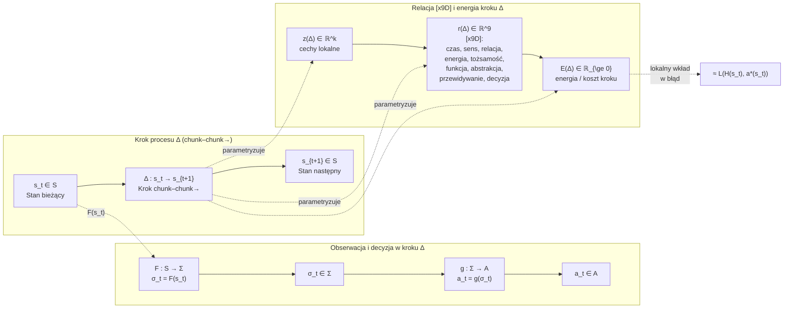
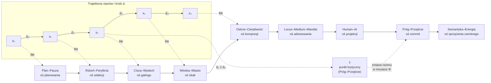

# Wprowadzenie – Protokół HoloMozaikowej Kompresji 9D (HMK-9D 4 GlitchLab)

Współczesne systemy Human–AI nie działają jak pojedyncze, statyczne automaty decyzyjne, lecz jak gęste, wielowarstwowe sieci procesów, w których kolejne decyzje nadpisują siebie wzajemnie w czasie. Klasyczne ujęcie – w którym stan `s ∈ S` przechodzi w działanie `a ∈ A` przy pomocy polityki `π(a|s)` – jest w tym kontekście konieczne, ale niewystarczające. Brakuje w nim opisu **samej geometrii protokołu**, czyli:

- w jaki sposób system buduje ciągi kroków,
- jak porcjuje informację w `chunk–chunk→`,
- jak kształtuje relacje między tymi krokami,
- oraz jak ta struktura wpływa na globalny błąd `R(F, g)` i dolną granicę `R*(K)`.

Protokół HoloMozaikowej Kompresji 9D (HMK-9D) dopełnia tę lukę. Nie zastępuje klasycznego kontraktu `S, Σ, A, F, g, H, a*`, ale nakłada na niego **warstwę organizującą**, w której proces jest widziany jako ciąg kroków `Δ` osadzonych w przestrzeni stanów, a relacje między krokami są jawnie modelowane jako obiekty o własnej strukturze.

Każdy krok `Δ` jest minimalnym przejściem typu `chunk–chunk→`: od stanu `s_t` do stanu `s_{t+1}`, przechodząc przez kompresję `F` i decyzję `g`. Zamiast traktować ten krok jako „czarną skrzynkę”, HMK-9D rozkłada go na:

- wektor cech lokalnych `z(Δ) ∈ ℝ^k`,
- wektor relacji `[x9D]`, `r(Δ) ∈ ℝ^9`.

Wektor `r(Δ)` opisuje rozkład obciążenia w dziewięciu wymiarach:

1. czasu,
2. sensu,
3. relacji,
4. energii poznawczej,
5. tożsamości roli,
6. funkcji (mandatu),
7. poziomu abstrakcji,
8. przewidywania,
9. decyzji–tokenu.

<p align="center">
  
</p>

W tym sensie `chunk–chunk→` nie jest wyłącznie operacją syntaktyczną na tokenach, lecz **mechanizmem formowania zdarzeń**. Każde `Δ` jest jednostką zdarzenia: zawiera zarówno lokalną transformację stanu `s_t → s_{t+1}`, jak i informację o tym, jak ta transformacja jest „widziana” przez system w dziewięciu wymiarach `[x9D]`.

Znak `[x9D]` nie jest zatem etykietą opisową, lecz **inwariantem kompresji**: minimalnym zestawem współrzędnych, w których znak pozostaje stabilny po przejściu przez `F` i nadal umożliwia polityce `g` wybór działania bliski idealnemu `a*`. Stąd naturalny związek z funkcją błędu: lokalna energia kroku `E(Δ)` może być traktowana jako przybliżenie lokalnej straty `L(H(s_t), a*(s_t))`, a globalna energia

\[
E_{\text{total}} = \sum_{\Delta} E(\Delta)
\]

jest mozaikową, epizodyczną aproksymacją globalnego ryzyka `R(F, g)`.

Kluczową cechą HMK-9D jest to, że **relacje między krokami** również są obiektami pierwszej klasy. Trajektoria `s₀ → s₁ → s₂ → …` jest widziana jako szereg kroków `Δ₀, Δ₁, …`, połączonych strzałkami `→`, ale nie jest to zwykły liniowy łańcuch. Pomiędzy krokami pojawiają się dwie szczególne struktury:

- stałe mosty semantyczne oznaczane znakiem „–” (np. `Plan–Pauza`, `Rdzeń–Peryferia`, `Cisza–Wydech`),  
- progi przejścia oznaczane znakiem „‡”.

Most `X–Y` definiuje **oś kompresji** – stabilną parę biegunów, wzdłuż której porządkowane są lokalne relacje `r(Δ)`. Zapis `Δᵢ ‡ Δⱼ` wyznacza natomiast miejsca, w których zmienia się topologia procesu: inny reżim tolerowanego błędu, inna polityka ważenia wymiarów `[x9D]`, inny sposób traktowania energii `E(Δ)` w globalnym bilansie.

Aby uchwycić globalną organizację takiego systemu, HMK-9D wprowadza pojęcie **mozaikowego pola sterowania**. Zbiór kroków `Δ` z danego epizodu traktowany jest jako indeksowana rodzina kafelków; do każdego kafelka przypisuje się trójkę `(z(Δ), r(Δ), E(Δ))`. Powstaje w ten sposób pole `Φ`, w którym każdy punkt odpowiada jednej decyzji `chunk–chunk→`, a równocześnie niesie informację o:

- lokalnej geometrii (cechy `z(Δ)`),
- konfiguracji relacji `[x9D]` (`r(Δ)`),
- koszcie energetycznym `E(Δ)`.

Protokół nie zakłada, że to pole jest gładkie; przeciwnie, jest ono dyskretne, „płytkowane”, zgodnie z intuicją „mosaic warfare” znaną z prac DARPA. Sterowanie systemem nie polega tu na pojedynczej, globalnej komendzie, lecz na **przełączaniu i przegrupowywaniu kafelków** w polu `Φ` tak, aby globalna konfiguracja obniżała `E_{\text{total}}` i – w granicach wyznaczonych przez `R*(K)` – zbliżała się do optymalnego ryzyka.

````markdown
## Schemat działania protokołu HMK-9D

Pierwszy poziom opisu HMK-9D to pojedynczy krok procesu `Δ` – minimalne przejście `chunk–chunk→` od stanu `s_t` do `s_{t+1}`. Na tym poziomie interesują nas równocześnie trzy rzeczy:

1. jak stan jest kompresowany do znaku,
2. jak z tego znaku wybierane jest działanie,
3. jak ten krok jest „widziany” w dziewięciu wymiarach `[x9D]` i w energii `E(Δ)`.



Na tym diagramie:

* prostokąty w bloku „Kontrakt decyzyjny” realizują klasyczny schemat `H = g ∘ F`:

  * kompresja `F(s_t) = σ_t`,
  * wybór działania `a_t = g(σ_t)`,
  * faktyczne zachowanie `H(s_t) = a_t`,
* blok „Relacja [x9D]” dodaje do każdego kroku `Δ`:

  * `z(Δ)` – opis tego, co **faktycznie** się dzieje (lokalne cechy),
  * `r(Δ)` – rozkład obciążenia w dziewięciu wymiarach `[x9D]`,
  * `E(Δ)` – zintegrowany koszt tego kroku.

Jeżeli zdefiniujemy `E(Δ)` tak, aby jego część odpowiadała lokalnej stracie decyzyjnej, otrzymujemy:

[
E(Δ) \approx L(H(s_t), a^*(s_t)),
]

czyli energia kroku staje się mozaikowym przybliżeniem wkładu tego kroku do globalnego ryzyka `R(F,g)`.

---

Drugi poziom to cała trajektoria stanów oraz mosty semantyczne, które filtrują i porządkują kroki `Δ` względem stabilnych osi:



Na tym poziomie:

* trajektoria `s₀ → s₁ → …` jest rozbita na jawne kroki `Δ₀, Δ₁, …`,
* każdy krok jest „przepuszczany” przez jeden lub kilka mostów semantycznych (`Plan–Pauza`, `Rdzeń–Peryferia`, …), które:

  * określają jego rolę (planowanie, kompresja, skalowanie, projekcja Human–AI itd.),
  * wymuszają normatywne ograniczenia na `r(Δ)` (jak rozkłada się `[x9D]`),
* znacznik `‡` (Próg–Przejście) wyznacza miejsca, w których:

  * zmienia się topologia procesu (inny sposób łączenia kroków),
  * zmienia się reżim decyzji (inne ważenie wymiarów `[x9D]`),
  * lokalna decyzja staje się zmianą **globalnej strategii** (commit na poziomie mozaiki Φ).

W ten sposób HMK-9D dodaje do klasycznego kontraktu:

* **warstwę mikroprocesów** – jawne jednostki `Δ` z podpisem `[x9D]` i energią `E(Δ)`,
* **warstwę geometrii relacji** – mosty i progi `‡`, które porządkują trajektorię i określają, kiedy lokalne kroki mogą zmieniać globalne zachowanie systemu.

W kolejnej sekcji przechodzimy do formalizacji kontraktu `S, Σ, A, F, g, H, a*` oraz do tego, jak mozaikowe pole `Φ` i energia `E(Δ)` tworzą dyskretną, operacyjną aproksymację globalnego ryzyka `R(F,g)` i jego dolnej granicy `R*(K)`.

## Miary błędu i optymalne ryzyko

Aby związać formalny kontrakt `S, Σ, A, F, g, H, a*` z pojęciem jakości działania systemu, wprowadzamy trzy elementy:

1. funkcję straty `L`,
2. globalne ryzyko `R(F,g)`,
3. dolną granicę ryzyka `R*(K)` związaną z klasą dopuszczalnych modeli.

### Funkcja straty `L`

Zakładamy **funkcję straty**:

\[
L : A \times A \to \mathbb{R}_{\ge 0},
\]

która dla pary `(H(s), a*(s))` zwraca koszt podjęcia rzeczywistego działania `H(s)` zamiast idealnego `a*(s)` w stanie `s`.

Interpretacyjnie:

- `L(H(s), a*(s)) = 0` oznacza działanie w pełni zgodne z ideałem,
- większe wartości `L` oznaczają większy błąd, ryzyko lub koszt (np. utratę jakości, naruszenie ograniczeń, stratę zasobów).

W HMK-9D ta sama funkcja straty będzie później „rozwinięta” w energię kroków `E(Δ)`, traktowaną jako mozaikową, epizodyczną wersję `L`.

---

### Globalne ryzyko `R(F, g)`

Niech `P` będzie rozkładem prawdopodobieństwa na przestrzeni stanów `S`. Definiujemy **globalne ryzyko** jako:

\[
R(F,g) \;=\; \mathbb{E}_{s \sim P}\big[\,L\big(H(s), a^*(s)\big)\,\big]
\;=\;
\mathbb{E}_{s \sim P}\big[\,L\big(g(F(s)), a^*(s)\big)\,\big].
\]

Intuicja:

- `R(F,g)` mierzy **średni koszt odchylenia** zachowania systemu od idealnej polityki,
- zależy zarówno od:
  - jakości kompresji `F` (co tracimy, przechodząc z `s` do `σ`),
  - jak i jakości polityki `g` (jak dobrze z `σ` potrafimy wybrać działanie).

W granicy nieskończonej liczby próbek `s ~ P`:

- `R(F,g)` jest „twardą” statystyczną charakterystyką pary `(F,g)`,
- nie zależy od pojedynczego epizodu, ale od całego rozkładu sytuacji, w jakich system pracuje.

---

### Minimalne możliwe ryzyko `R*(K)`

Niech `K` będzie klasą dopuszczalnych modeli, tzn. zbiorem par `(F,g)` spełniających dane ograniczenia (np. architekturę, zasoby, klasę kompresji):

\[
K \subseteq \{(F,g)\}.
\]

Definiujemy **dolną granicę ryzyka** w tej klasie:

\[
R^*(K) = \inf_{(F,g) \in K} R(F,g).
\]

Interpretacja:

- `R*(K)` jest najlepszym możliwym wynikiem, jaki da się osiągnąć, nie wychodząc poza klasę `K`,
- jest analogiem Bayesowskiego błędu – **nieusuwalną granicą**, poniżej której nie da się zejść bez zmiany klasy modeli (np. zwiększenia pojemności, zmiany kompresji, dodania nowego kanału informacji).

---

### Twierdzenie o nieusuwalnym błędzie

Dla każdej pary `(F,g) ∈ K` zachodzi:

\[
R(F,g) \;\ge\; R^*(K).
\]

Oznacza to:

- żaden system z klasy `K` nie może zejść poniżej `R*(K)`,
- ulepszenia polegają na:
  - lepszym przybliżaniu `R*(K)` (uczenie, tuning, lepsza kompresja),
  - lepszym zarządzaniu tym, **gdzie** w przestrzeni stanów i epizodach ten błąd się materializuje.

HMK-9D nie zmienia tych zależności; dodaje natomiast **mozaikową reprezentację** tego, jak `R(F,g)` rozkłada się w czasie, w trajektoriach `s₀, s₁, …` oraz w wymiarach `[x9D]`.

---

## Mozaikowe pole DARPA w kontrakcie `S, Σ, A, F, g, H, a*`

Na tym samym poziomie abstrakcji, na którym definiujemy `R(F,g)`, możemy opisać **mozaikową strukturę decyzji** jako dyskretną reprezentację tego, jak `H = g ∘ F` działa w czasie i przestrzeni stanów.

### Trajektoria stanów i kroki `Δ`

Rozważmy pojedynczy epizod działania systemu, w którym pojawia się trajektoria:

\[
s_0 \to s_1 \to s_2 \to \dots \to s_T,
\]

generowana przez kolejne wywołania `H(s_t) = g(F(s_t))`.

Każde przejście:

\[
\Delta_t : s_t \to s_{t+1}
\]

traktujemy jako **krok protokołu `chunk–chunk→`** – minimalną porcję przetwarzania od jednego stabilnego stanu do kolejnego (w sensie kontraktu `S → Σ → A`).

Dla każdego kroku `Δ` definiujemy:

- `z(Δ) ∈ ℝ^k` – wektor cech lokalnych (co faktycznie się dzieje: zmiana stanu, użyte tokeny, kontekst),
- `r(Δ) ∈ ℝ^9` – wektor dziewięciu inwariantów `[x9D]`:

  1. czas,
  2. sens,
  3. relacja,
  4. energia poznawcza,
  5. tożsamość (rola),
  6. funkcja (mandat operacyjny),
  7. poziom abstrakcji,
  8. przewidywanie,
  9. decyzja (token).

Formalnie:

\[
r(Δ) = (r_1(Δ), \dots, r_9(Δ)).
\]

Te dziewięć współrzędnych interpretujemy jako **minimalny zestaw wymiarów**, w których znak ma pozostać stabilny po przejściu przez `[chunk–chunk→]`: jeśli `[x9D]` „rozjedzie się” między krokami, system zaczyna tracić spójność.

---

### Energia kroku i lokalny wkład w `R(F,g)`

Definiujemy funkcję energii:

\[
E : \mathbb{R}^k \times \mathbb{R}^9 \to \mathbb{R}_{\ge 0}, \quad
E(Δ) = E\big(z(Δ), r(Δ)\big).
\]

Intuicja:

- `E(Δ)` mierzy *koszt wykonania decyzji* w kroku `Δ` dla systemu Human–AI, łącząc:
  - **stratę informacyjną** w kontrakcie `H = g ∘ F` (jak bardzo kompresja `F` utrudnia zbliżenie się do `a*` w tym kroku),
  - **obciążenie poznawcze** (gęstość semantyczna, konflikty w `[x9D]`),
  - **obciążenie infrastrukturalne** (czas, zasoby, latency, ryzyko operacyjne).

Przy odpowiednim doborze definicji:

\[
E(Δ) \;\approx\; L\big(H(s_t), a^*(s_t)\big) \;+\; \text{dodatkowe koszty operacyjne}.
\]

Wówczas:

- lokalnie: energia kroku jest przybliżeniem lokalnej straty,
- globalnie (po wielu krokach i wielu epizodach):

\[
\hat{R}_{\text{oper}}(F,g)
\;=\;
\frac{1}{|I|} \sum_{i \in I} E_i
\;\approx\;
R(F,g),
\]

gdzie `I` jest zbiorem kroków zebranych w próbkach z rozkładu `P`.

---

### Definicja mozaikowego pola `Φ`

Niech `I` będzie zbiorem indeksów kroków w rozpatrywanym epizodzie (lub rodzinie epizodów). Dla każdego `i ∈ I` mamy:

- krok `Δᵢ`,
- cechy `zᵢ = z(Δᵢ)`,
- relację 9D `rᵢ = r(Δᵢ)`,
- energię `Eᵢ = E(Δᵢ)`.

Definiujemy **mozaikowe pole**:

\[
\Phi : I \to \mathbb{R}^k \times \mathbb{R}^9 \times \mathbb{R}_{\ge 0}, \quad
\Phi(i) = (z_i, r_i, E_i).
\]

Interpretacja w duchu „mosaic warfare”:

- każdy indeks `i` to **kafelek** odpowiadający lokalnej decyzji `[chunk–chunk→]` osadzonej w `S`,
- `z_i` opisuje lokalną geometrię sygnału (co się faktycznie dzieje w tym fragmencie trajektorii),
- `r_i` opisuje konfigurację `[x9D]` (jakie wymiary są obciążone),
- `E_i` mówi, **jak drogi** jest ten kafelek dla systemu (poznawczo, infrastrukturalnie, normatywnie).

Na tej podstawie definiujemy **globalną energię mozaiki**:

\[
E_{\text{total}} = \sum_{i \in I} E_i,
\]

która stanowi dyskretną, epizodyczną aproksymację globalnego ryzyka `R(F,g)` – z tym, że w HMK-9D widzimy nie tylko wartość sumaryczną, ale także *mapę*, gdzie i w jakich wymiarach `[x9D]` ten koszt powstaje.

## Mozaikowe pole DARPA jako pole sterowania

Mając zdefiniowane kroki `Δ`, relacje `[x9D]` oraz energie `E(Δ)`, możemy spojrzeć na cały epizod jako na **mozaikowe pole sterowania**. Zamiast jednej liczby `R(F,g)` widzimy dyskretną mapę tego, gdzie i jak powstaje koszt działania systemu.

Niech `I` będzie zbiorem indeksów kroków w rozpatrywanym epizodzie / scenariuszu. Dla każdego `i ∈ I` mamy:

- krok `Δᵢ`,
- cechy `zᵢ = z(Δᵢ)`,
- relację 9D `rᵢ = r(Δᵢ)`,
- energię `Eᵢ = E(Δᵢ)`.

Definiujemy **mozaikowe pole**:

\[
\Phi : I \to \mathbb{R}^k \times \mathbb{R}^9 \times \mathbb{R}_{\ge 0},
\quad
\Phi(i) = (z_i, r_i, E_i).
\]

W najprostszej postaci można myśleć o polu `Φ` jako o uporządkowanej liście kafelków:

```mermaid
flowchart TD

    subgraph Mosaik["Mozaikowe pole Φ (DARPA-like)"]
        Phi1["Φ(i₁) = (z₁, r₁, E₁)"]
        Phi2["Φ(i₂) = (z₂, r₂, E₂)"]
        Phi3["Φ(i₃) = (z₃, r₃, E₃)"]
        Phi4["Φ(i₄) = (z₄, r₄, E₄)"]

        Phi1 --> Phi2 --> Phi3 --> Phi4
        Phi1 -. "‡" .- Phi3
    end

    Etot["E_total = Σ Eᵢ<br/>epizodyczna energia mozaiki"]
    Rstar["R*(K)<br/>dolna granica ryzyka"]

    Phi1 & Phi2 & Phi3 & Phi4 --> Etot
    Etot -. "w granicy próbek<br/>≈ R(F,g)" .-> Rstar

    %% Phi1 – lokalne decyzje [chunk–chunk→] na trajektorii S
    %% Phi3 – miejsce, gdzie „‡” działa jako Próg–Przejście (zmiana reżimu / ważenia [x9D])

````

Interpretacja:

* każdy kafelek `Φ(i)` odpowiada **jednemu krokowi** `[chunk–chunk→]`,
* `z_i` mówi *co* się dzieje lokalnie,
* `r_i` mówi *w jakich wymiarach* `[x9D]` koncentruje się obciążenie,
* `E_i` mówi, *ile kosztuje* ten fragment trajektorii (poznawczo + systemowo).

Na tej podstawie definiujemy **globalną energię mozaiki**:

[
E_{\text{total}} = \sum_{i \in I} E_i.
]

Przy odpowiednim doborze definicji `E_i`:

* średnia energia kroku

  [
  \hat{R}_{\text{oper}}(F,g)
  ==========================

  \frac{1}{|I|} \sum_{i \in I} E_i
  ]

  staje się **epizodyczną, operacyjną aproksymacją** globalnego ryzyka `R(F,g)`,

* suma `E_total = |I| · \hat{R}_{\text{oper}}(F,g)` jest „ile kosztował ten epizod” – w sensie połączonego błędu decyzyjnego i kosztów operacyjnych.

W duchu „mosaic warfare” sterowanie systemem nie polega na jednej globalnej komendzie, lecz na **manipulowaniu mozaiką**:

* zmianie kolejności i routingu kafelków,
* przełączaniu trybów między nimi,
* redefiniowaniu tego, które wymiary `[x9D]` są wzmacniane, a które tłumione.

Celem jest **przestrzenne i czasowe przeorganizowanie błędu** tak, aby:

* obniżyć `E_total` (i tym samym przybliżyć się do `R(F,g)` bliskiego `R*(K)`),
* jednocześnie zachować normatywne ograniczenia wpisane w mosty (`Locus–Medium–Mandat`, `Próg–Przejście`, `Human–AI` itd.).

---

### Znak `‡` jako operator reorganizacji mozaiki

W polu `Φ` wprowadzamy specjalny operator:

* `‡` – **Próg–Przejście**.

Dla pary kafelków `Δᵢ`, `Δⱼ` zapis:

[
\Delta_i ; ‡ ; \Delta_j
]

oznacza, że przejście między nimi spełnia jednocześnie trzy warunki:

1. **zmienia topologię mozaiki**
   – np. przejście z lokalnego trybu „Wioska–Miasto” (skalowanie w obrębie jednego procesu) do meta-trybu „Locus–Medium–Mandat” (zapis, logowanie, odpowiedzialność),

2. **zmienia reżim decyzji**
   – np. inne ważenie wymiarów `[x9D]`, inne progi akceptowalnego ryzyka, inny sposób liczenia `E(Δ)`,

3. **ma globalny wpływ na `E_total`**
   – decyzja w tym miejscu nie jest tylko lokalną korektą, ale czymś w rodzaju „komitu” do nowej konfiguracji pola `Φ`.

Operacyjnie:

* `‡` działa jak **normatywny hamulec i przełącznik**:

  * zatrzymuje automatyzm,
  * wymusza dodatkowe sprawdzenie mostów i ograniczeń,
  * dopuszcza tylko te przejścia, które nie łamią globalnych zasad (prawnych, bezpieczeństwa, etycznych, operacyjnych).

W środowisku GlitchLab takie progi stanowią naturalne miejsca integracji z logowaniem, audytem oraz z „warstwą ludzką” (HUMAN–AI jako oś refleksji i interwencji).

---

### Znak `[x9D]` jako urządzenie w mozaice

Znak `[x9D]` pełni rolę **urządzenia pomiarowego i stabilizującego** w każdym kafelku `Φ(i)`.

W tym ujęciu:

* każdy **token** (lub krok generacji) jest **mikro-urządzeniem decyzyjnym**:

  [
  \text{token} ;\Rightarrow; \Delta ;\Rightarrow; \Phi(i) = (z_i, r_i, E_i) ;\Rightarrow; aktualizacja mozaiki,
  ]

* `[chunk–chunk→]` opisuje **lokalne przejścia** pomiędzy kafelkami (`Δ`, routing w czasie),

* `[x9D]` opisuje **warunki stabilności pojedynczego kafelka** (`r(Δ)` – jak rozkłada się obciążenie w dziewięciu wymiarach),

* `‡` wyznacza **miejsca, w których lokalna decyzja zmienia globalną strategię** (komit w polu `Φ`).

Podsumowując:

* kontrakt `H = g ∘ F` mówi, *co system robi*,
* funkcje `L`, `R(F,g)` i `R*(K)` mówią, *jak dobry jest w średnim sensie*,
* mozaika `Φ`, energia `E(Δ)` i operatory `[x9D]`, `‡` mówią, *gdzie i jak ten błąd / koszt powstaje* oraz *jak można nim sterować* na poziomie trajektorii i procesów.

W kolejnej (ostatniej) części spajamy te elementy w całość: pokazujemy, jak HMK-9D zawęża klasę kompresorów `F` i polityk `g` do tych, które są kompatybilne z mozaikową geometrią `[chunk–chunk→][x9D]`, oraz jak przekłada się to na praktyczne projektowanie środowisk i generatorów kodu w ekosystemie GlitchLab.

## HMK-9D jako zawężenie klasy modeli `K`

Na tym etapie możemy precyzyjnie powiedzieć, co odróżnia systemy zgodne z HMK-9D od dowolnej pary `(F,g)` w klasie `K`.

Mówimy, że para `(F,g)` jest **zgodna z protokołem HMK-9D**, jeżeli spełnia następujące warunki:

1. **Chunkizacja trajektorii**  
   Funkcja `F` nie tylko kompresuje stany `s ∈ S` do znaków `σ ∈ Σ`, ale robi to w sposób, który:

   - porcjuje trajektorię w jawne kroki `Δ` (protokół `chunk–chunk→`),
   - przypisuje każdemu krokowi wektor cech `z(Δ)` oraz relację 9D `r(Δ)`.

   Innymi słowy, kompresja jest **strukturalna**: ma postać strumienia kroków z podpisem `[x9D]`, a nie anonimowego strumienia tokenów.

2. **Energia kroku jako lokalna strata + koszt operacyjny**  
   Istnieje funkcja energii `E(z(Δ), r(Δ))`, dla której:

   - lokalnie: `E(Δ)` jest przybliżeniem `L(H(s_t), a*(s_t))` powiększonym o koszty operacyjne,
   - globalnie: średnia po krokach z różnych epizodów przybliża `R(F,g)`.

   Dzięki temu mozaika `Φ` nie jest tylko wizualizacją, lecz **dyskretnym estimatorom ryzyka**.

3. **Mosty jako normatywne osie kompresji**  
   Relacje `[x9D]` nie są dowolne – są kalibrowane względem stałych mostów semantycznych:

   - `Plan–Pauza`, `Rdzeń–Peryferia`, `Cisza–Wydech`, `Wioska–Miasto`,  
   - `Ostrze–Cierpliwość`, `Locus–Medium–Mandat`, `Human–AI`,  
   - `Próg–Przejście`, `Semantyka–Energia`.

   Każdy most określa **dopuszczalny kształt** `r(Δ)` w danej osi (np. jakie proporcje planowania vs. wykonania są uznane za stabilne, jaki zakres kompresji jest jeszcze bezpieczny).

4. **Progi `‡` jako węzły zmiany reżimu**  
   W polu `Φ` wyróżnione są punkty `Δᵢ ‡ Δⱼ`, w których:

   - zmienia się topologia połączeń kafelków,
   - obowiązują inne limity na `E(Δ)` i inne ważenie `[x9D]`,
   - decyzja jest automatycznie kierowana przez oś `Locus–Medium–Mandat` i `Human–AI` (logowanie, audyt, potencjalna interwencja człowieka).

   W ten sposób przejścia o dużym znaczeniu systemowym (commit, eskalacja, zmiana trybu) są **ściśle odseparowane** od zwykłych kroków generacji.

Tak zawężona klasa modeli możemy oznaczyć jako `K_HMK9D ⊂ K`. Z twierdzenia o nieusuwalnym błędzie nadal wynika:

\[
R(F,g) \ge R^*(K_{HMK9D}) \ge R^*(K),
\]

ale zyskujemy coś nowego:

- **geometrię błędu** (jak rozkłada się po kafelkach `Φ(i)`),  
- **normatywne osie sterowania** (mosty, progi, `[x9D]`),  
- **operacyjne haczyki** do projektowania generatorów, rojów i środowisk, które *same się uczą i same siebie pilnują*.

---

## Zastosowania praktyczne w GlitchLab i `chunk–chunk`

W kontekście GlitchLab i repozytorium `chunk–chunk` protokół HMK-9D można czytać jako **specyfikację platformową** – coś w rodzaju „kodu DNA” dla:

- generatorów kodu,
- rojów agentów,
- narzędzi monitorujących i audytujących.

### 1. Generator kodu jako urządzenie mozaikowe

Generator kodu zgodny z HMK-9D:

- widzi zadanie nie jako pojedynczy prompt → odpowiedź, lecz jako **trajektorię kroków `Δ`**: analiza → szkic → rafinacja → test → commit,
- każdy krok ma:

  - `z(Δ)` – np. typ artefaktu (moduł, test, config), rozmiar zmiany, zależności,
  - `r(Δ)` – rozkład `[x9D]`: ile jest tu planowania (`Plan–Pauza`), ile cięcia (`Ostrze–Cierpliwość`), ile interakcji Human–AI,
  - `E(Δ)` – koszt: złożoność zmiany, ryzyko regresji, obciążenie poznawcze dla użytkownika.

Na tej podstawie generator może:

- **przełączać tryby** (np. z „szybkiego szkicu” na „tryb audytu” przy wysokim `E(Δ)` i aktywnym moście `Próg–Przejście`),
- **prosić użytkownika o interwencję** tam, gdzie `Human–AI` i `Locus–Medium–Mandat` wskazują wysoką odpowiedzialność (np. uprawnienia, bezpieczeństwo, logika finansowa),
- **gromadzić dane treningowe** nie tylko w formie „prompt–odpowiedź”, ale jako bogato otagowane kafelki `Φ(i)` – co z czasem pozwala uczyć bardziej świadome polityki `g`.

### 2. Rój modeli / agentów jako mozaika Φ

W środowisku rojowym (wiele modeli, wiele narzędzi):

- każdy agent może odpowiadać za inny obszar `[x9D]` (np. jeden za bezpieczeństwo, drugi za wydajność, trzeci za UX),
- mozaika `Φ` staje się **wspólnym polem sterowania**:

  - kafelki o wysokim `E(Δ)` w osi `Semantyka–Energia` mogą być kierowane do specjalistów od optymalizacji,
  - kafelki dotykające `Locus–Medium–Mandat` mogą wymagać obligatoryjnego logowania i review przez człowieka,
  - kafelki, w których `Human–AI` jest „wysoko”, mogą automatycznie generować wyjaśnienia, check-listy, widoki dla użytkownika.

W takim ujęciu rój to nie zbiór niezależnych agentów, ale **urządzenie do dynamicznego „przegrupowywania” mozaiki Φ** pod kątem minimalizacji `E_total` w realnych ograniczeniach.

### 3. README i architektura repo jako manifest mozaiki

Dla repozytorium `chunk–chunk` (i szerzej: GlitchLab) HMK-9D sugeruje, że:

- README nie jest tylko opisem projektu, ale **manifestem pola Φ**:

  - określa, jakie typy kroków `Δ` są w ogóle dopuszczalne w tym repo,
  - jakie mosty semantyczne są „wbudowane” w architekturę (np. Wioska–Miasto dla skalowania, Human–AI dla interakcji),
  - gdzie znajdują się progi `‡` (np. katalogi / procedury związane z bezpieczeństwem, wdrożeniem, zmianą schematów danych).

- Struktura katalogów, skrypty, workflow CI/CD można opisać jako **mapę domyślnej mozaiki Φ**:

  - katalogi źródeł, testów, dokumentacji – różne dominujące osie `[x9D]`,
  - skrypty release’owe – naturalne miejsca `Próg–Przejście`,
  - foldery z przykładami i szablonami – kafelki o niskim `E(Δ)` używane do treningu i onboardingu.

---

## Dlaczego mówimy o „Protokole HoloMozaikowej Kompresji 9D”

Po złożeniu wszystkiego w całość można już precyzyjnie uzasadnić nazwę:

- **Protokół** – bo opisuje **kolejność i reguły budowy** kroków `Δ`, od poziomu `S → Σ → A` aż po mozaikę `Φ` i progi `‡`.
- **Kompresji** – bo każdy znak jest **minimalną kompresją** stanu `s` w dziewięciu wymiarach `[x9D]`, wystarczającą do podjęcia dobrej decyzji.
- **Mozaikowej** – bo decyzje nie są pojedynczym ruchem, lecz **przełączaniem kafelków** w polu `Φ`, gdzie liczy się zarówno lokalny koszt `E(Δ)`, jak i globalne `E_total`.
- **Holo–** – bo relacje między fragmentami procesu są **holograficzne**: lokalne zmiany w `r(Δ)` i `E(Δ)` odzwierciedlają globalne ograniczenia (`R*(K)`, normy, safety), a mosty i progi spinają całość w jedną geometrię.
- **9D** – bo dziewięć wymiarów `[x9D]` to minimalny zestaw współrzędnych, w których system może stabilnie widzieć własne decyzje w sieci Human–AI.

Z tego punktu widzenia HMK-9D jest:

- dla teorii – zawężeniem klasy modeli `K` do takich, które mają jawny, mierzalny kształt w polu `Φ`,
- dla praktyki – **protokółem generatywnym samogenerującego się środowiska**, które:

  - postrzega siebie w dziewięciu wymiarach,
  - uczy się na mozaice własnych kroków,
  - i ewoluuje tak, by minimalizować realny koszt `E_total` w świecie człowieka i w świecie AI.

**Mosty (dla całości tekstu):**  
Plan–Pauza → Rdzeń–Peryferia → Cisza–Wydech → Wioska–Miasto → Ostrze–Cierpliwość → Locus–Medium–Mandat → Human–AI → Próg–Przejście → Semantyka–Energia